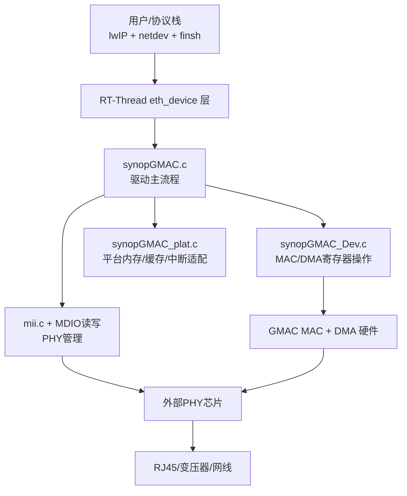
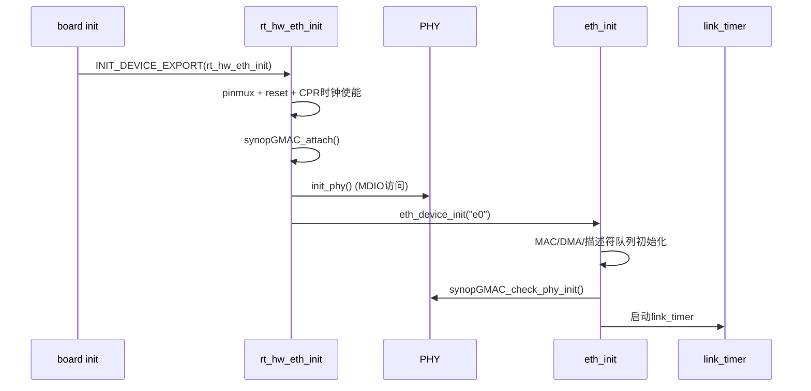

# HE200 GMAC 调试记录

本文档用于记录 `bsp/lynxi/he200/drivers/net/gmac` 当前网络链路问题的调试状态与操作步骤。

**初始化口径（2026-06）**：对齐 Zephyr `he200_ep` + lynxi-linux——`lynxi_sysctl_lite_gmac_probe_clocks()`（probe 不写 `0x66f`）、RTL8211F 用 **BMCR 软复位**（跳过 `portd:23` GPIO 硬复位，实板 DDR 会挂死）、**`rgmii-id` PHY TX/RX delay**（`lynxi_rtl8211f_rgmii_id_config()`，对齐 Linux `realtek.c`）。详见 [`../../移植记录.md`](../../移植记录.md) §8。

**测试环境**：[`../../scripts/he200_test_env.sh`](../../scripts/he200_test_env.sh) + [`../../测试环境.md`](../../测试环境.md)。直连网段：`Host 192.168.1.1` ↔ `EP 192.168.1.2`（`enp25s0f1`）。

**配置互斥**：调试板载 GMAC 时 **关闭 `BSP_USING_RPMSG_NET`**（Kconfig 已与 GMAC 互斥）。`e0_isr` 须 `rt_hw_interrupt_set_triger_mode(78, 1)`（Linux `IRQ_TYPE_LEVEL_HIGH`）并绑定 CPU0。

## 1. 现象与根因（2026-06-06 更新）

历史现象：

- Host 侧网口（`enp25s0f1`）`Link detected: no`
- 设备侧 `e0` 显示 `LINK_UP`，但与 Host 互 ping 不通
- `ifconfig` 统计中 Host RX 为 0

根因之一：Linux EVB 使用 `phy-mode=rgmii-id`，旧驱动未配置 RTL8211F 内部 delay，导致物理层协商失败（`anlpar=0000`）。已合入 `lynxi_rtl8211f_rgmii_id_config()`。

实板复验命令（MSH）：

```text
ifconfig
list_isr
ping 192.168.1.1
```

Host 侧：`sudo ./scripts/he200_test_env.sh` 后 `ping 192.168.1.2`、`iperf3 -s`。

## 2. 当前代码中的诊断日志

文件：`synopGMAC.c`

### 2.1 初始化 PHY 诊断

日志前缀：

- `gmac phy[init]: ...`

字段说明：

- `addr`：PHY 地址
- `id`：`PHYID1:PHYID2`
- `bmcr`：基础控制寄存器
- `bmsr`：基础状态寄存器
- `anar`：本端自协商广告
- `anlpar`：对端返回能力
- `stat1000`：千兆协商结果
- `ctl1000`：千兆能力广告控制
- `estatus`：扩展能力状态
- `link`：链路状态位（由 `BMSR_LSTATUS` 解析）
- `aneg_en`：是否启用自协商
- `aneg_done`：自协商是否完成

### 2.2 BMSR 变化日志（插拔感知）

日志前缀：

- `gmac phy[bmsr-change]: old -> new (link=.. aneg_done=..)`

说明：

- 仅在 `BMSR` 发生变化时打印，避免刷屏。
- 可用于判断 PHY 是否感知到网线插拔/链路状态变化。

## 3. 已观测到的关键日志

示例：

`gmac phy[init]: addr=1 id=001c:c916 bmcr=1040 bmsr=7989 anar=01e1 anlpar=0000 stat1000=0000 ctl1000=0200 estatus=2000 link=0 aneg_en=1 aneg_done=0`

解读：

- `id=001c:c916`：MDIO 可通信，PHY 可被识别。
- `ctl1000=0200`：本端已宣告 1000M Full 能力。
- `aneg_en=1`、`aneg_done=0`：自协商未完成。
- `anlpar=0000`：未收到对端能力页。

结论：更偏向物理层链路问题（线缆/接口/变压器/PHY 侧硬件路径/时钟复位），而非 IP 协议栈问题。

## 4. 推荐调试步骤

1. 仅上电，不插网线，记录一次 `gmac phy[init]`。
2. 插网线，观察是否出现 `gmac phy[bmsr-change]`。
3. 拔网线，再观察一次 `bmsr-change`。
4. Host 侧同时执行：
   - `ethtool enp25s0f1`
   - `ip link show enp25s0f1`
5. 若一直 `Link detected: no` 且设备侧 `anlpar` 始终为 `0000`，优先检查：
   - 网线与对端端口
   - PHY 复位与供电
   - RGMII/RMII 模式匹配
   - 板级变压器与差分线连接
   - pinmux 是否与其他功能冲突

## 5. 备注

- 目前调试重点是“链路建立”而非“IP 路由”。
- 在链路未建立时，ping、ARP、网关配置结论都不可靠。

## 6. GMAC 结构图

### 6.1 软件分层结构



### 6.2 关键数据结构

- `struct synopGMACNetworkAdapter`：驱动核心上下文（MII、GMAC 设备、收发状态）。
- `synopGMACdevice`：MAC/DMA 硬件寄存器与描述符队列控制状态。
- `struct rt_eth_dev eth_dev`：RT-Thread 侧网卡对象，注册名 `e0`。
- `struct rt_timer link_timer`：周期性链路检查（`synopGMAC_linux_cable_unplug_function`）。
- `struct rt_timer rx_poll_timer`：接收轮询兜底（配合中断模式）。

## 7. 实现原理

### 7.1 基本工作机制

1. **板级前置配置**：配置 pinmux、CPR/sysctl 时钟门控、PHY reset。
2. **MAC/DMA 初始化**：设置寄存器、描述符队列、DMA 基地址、收发阈值。
3. **PHY 协商**：通过 MDIO 读写 PHY，启动/观察自协商，得到速率和双工。
4. **链路联动**：链路上/下变化时，重新配置 MAC 速率相关控制位。
5. **数据通路**：
   - TX：lwIP pbuf -> 驱动封装 -> DMA 描述符 -> MAC 发包
   - RX：DMA 收包 -> 驱动取包 -> 交给 lwIP/netdev

### 7.2 速率/双工来源

- `synopGMAC_check_phy_init()` 通过 MII 状态判断链路与协商结果。
- 结果回写 `gmacdev->Speed` 与 `gmacdev->DuplexMode`。
- 然后调用 `lynxi_gmac_set_ctrl_by_speed()` 同步 CPR/GMAC 速率控制。

## 8. 初始化流程



## 9. 收发流程

### 9.1 发送（TX）流程


### 9.2 接收（RX）流程


## 10. 链路检测与状态机

`link_timer` 周期调用 `synopGMAC_linux_cable_unplug_function()`，核心逻辑：

1. 读取 PHY 链路状态（含去抖动计数）。
2. 若连续判定 down：设置 `LinkState=0`，打印 `No Link`。
3. 若连续判定 up：重新读取协商结果，更新 MAC 配置并打印速率。
4. 本次调试新增：
   - `gmac phy[init]`：初始化寄存器快照
   - `gmac phy[bmsr-change]`：仅在 BMSR 变化时打印

该机制可用于区分：

- **MDIO不通**（读不出稳定 ID）
- **PHY可见但无物理链路**（`anlpar=0`、`aneg_done=0`）
- **链路抖动**（BMSR 频繁变化）
