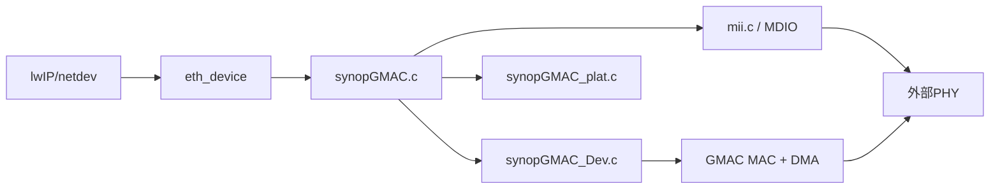

# HE200 BSP 外设移植记录

本文档记录 `bsp/lynxi/he200` 上与 SoC 外设相关的移植内容，便于对照 Linux DTS/手册与后续维护。基址与偏移以 [`drivers/lynxi.h`](drivers/lynxi.h) 为准（`PER_BASE = 0`）。

---

## 1. 范围说明

- **KA200 与 KA200_EP / KA200_RC**：同一 SoC，**仅 PCIe 驱动与相关 CPR 门控（`0x84`）不同**；UART、eMMC、GMAC、I2C、DMA、SMP 等模块在 SKU 间相同。新增驱动请放在公共 BSP 路径，勿按 EP/RC 复制一套外设实现。Zephyr 侧见 `zephyr/boards/lynxi/PORTING.md` §1.1。

- **两种“复位”概念**（勿混淆）  
  - **KA200 / 整片或系统级复位**：由看门狗、PMIC、上电时序等触发，**本 BSP 外设驱动不会在 init 里做整片复位**。  
  - **CPR 对各 IP 的软件复位**：[`drv_reset.c`](drivers/drv_reset.c) 通过 `CPR` 寄存器对 ETH、I2C、RTC、DMA 等**单模块**拉复位再释放；`lynxi_reset_pulse()` 属于后者，**不是**整片复位。脉冲保持时间使用 **`rt_hw_us_delay` 忙等**，可在调度器启动前调用（不再使用 `rt_thread_mdelay`）。
- **已集成驱动**：复位控制、DW APB I2C、DW RTC、eFuse、DW AXI DMAC（mem2mem 辅助）、GMAC、GPIO、UART、SDHCI、PCIe EP、定时器等（见下表）。
- **已移除**：PVT 温度监控驱动（原 `drv_pvt.c` 及 `BSP_USING_PVT`、`PVT_BASE` 等已删除）；若需恢复，需重新增加基址与驱动并与手册对齐。
- **网口**：GMAC 位于 `drivers/net/gmac/`，依赖 lwIP 与 PIN；细节见该目录内实现与 Kconfig。

---

## 2. 外设与源文件对照

| 功能 | 主要源文件 | Kconfig / 内核选项 | 说明 |
|------|------------|-------------------|------|
| CPR IP 软件复位 | [`drivers/drv_reset.c`](drivers/drv_reset.c)、[`drv_reset.h`](drivers/drv_reset.h) | `BSP_USING_RESET`、`BSP_USING_RESET_CTRL` | `CPR_BASE` 按线控制各 IP；`lynxi_reset_pulse` 内为 `rt_hw_us_delay` 忙等；MSH `reset_pulse` |
| DW APB I2C | [`drivers/drv_i2c.c`](drivers/drv_i2c.c) | `BSP_USING_I2C`、`BSP_USING_I2C0`~`I2C3`，依赖 `BSP_USING_RESET` | 轮询主机；init 中对对应 I2C 做 CPR IP 脉冲后配置控制器 |
| DW RTC | [`drivers/drv_rtc.c`](drivers/drv_rtc.c) | `BSP_USING_RTC`、`RT_USING_RTC`，依赖 `BSP_USING_RESET` | init 中 CPR IP 脉冲 RTC 线；`CCVR`/`CLR`/`CCR` |
| eFuse | [`drivers/drv_efuse.c`](drivers/drv_efuse.c)、[`drv_efuse.h`](drivers/drv_efuse.h) | `BSP_USING_EFUSE` | 可见范围 0x200；对齐 volatile 读；`lynxi_efuse_read_chip_id`；MSH `efuse_dump`、`efuse_chip_id` |
| DW AXI DMA | [`drivers/drv_dw_axi_dma.c`](drivers/drv_dw_axi_dma.c) | `BSP_USING_DW_AXI_DMA`，依赖 `BSP_USING_RESET` | init 中 CPR IP 脉冲 DMA；ch0 contiguous mem2mem；失败回退 CPU memcpy；`dma_memcpy_test` |
| GPIO | [`drivers/drv_gpio.c`](drivers/drv_gpio.c) | `BSP_USING_PIN` 等 | 与 GMAC pinmux 等配合 |
| GMAC | `drivers/net/gmac/*` | `BSP_USING_GMAC`、`RT_USING_LWIP` | Synopsys GMAC；调试手册见 [`drivers/net/gmac/DEBUG.md`](drivers/net/gmac/DEBUG.md) |
| sysctl 时钟门控 | [`drivers/clock/drv_sysctl_lite.c`](drivers/clock/drv_sysctl_lite.c) | `BSP_USING_SYSCTL_CLK`（默认 y） | Linux `clk-lynxi-lite.c`；board init 开 fabric/GPIO/eMMC gate；GMAC 在 `rt_hw_eth_init` 调 `lynxi_sysctl_lite_gmac_probe_clocks()` |

---

## 3. 基址一览（`PER_BASE + offset`）

| 符号 | 偏移 | 备注 |
|------|------|------|
| `I2C0_BASE` | `0x10002000` | |
| `I2C1_BASE` | `0x10003000` | |
| `I2C2_BASE` | `0x10004000` | |
| `I2C3_BASE` | `0x10005000` | |
| `RTC_BASE` | `0x10014000` | |
| `DW_AXI_DMA_BASE` | `0x1001A000` | |
| `EFUSE_BASE` | `0x12300000` | |
| `CPR_BASE` | `0x12500000` | 与复位控制同源（`RST_CTRL_BASE_OFFSET` 同数值） |

---

## 4. 复位线映射（`drv_reset.c` 内部表）

与 [`drv_reset.h`](drivers/drv_reset.h) 中 `enum lynxi_reset_line` 对应（`CPR_BASE + 寄存器偏移`，位号）：

| 线 | 寄存器偏移 | bit | Linux `lynchip-lite-resets.h` |
|----|------------|-----|-------------------------------|
| ETH (GMAC) | **`0x8c`** | 0 | `LITE_GMAC_R` (1120) |
| I2C0~3 | `0x90` | 0~3 | — |
| RTC | `0x94` | 0 | — |
| DMA | `0x98` | 0 | — |

**勿将 ETH 映射到 `0x88` bit0**：该位为 **`LITE_EMMC_R`**（eMMC IP 复位），误写会导致 eMMC/系统挂死（Zephyr 实板已验证）。

极性对齐 **`reset-lynchip-lite.c`**：**assert = 清 bit，deassert = 置 bit**（与常规 “写 1 复位” 相反）。`lynxi_reset_pulse(..., delay_ms)` 保持时间为 **`rt_hw_us_delay` 忙等**（可在 `INIT_BOARD_EXPORT` 阶段使用）。

---

## 5. 配置与编译

1. 在 BSP 目录修改配置：  
   `scons --menuconfig` 或直接编辑 [`.config`](.config)。
2. 由 `.config` 生成 [`rtconfig.h`](rtconfig.h)：  
   `scons --useconfig=.config`
3. 指定 AArch64 工具链前缀后编译：  
   `export RTT_CC_PREFIX=<path>/bin/aarch64-none-elf-`  
   `scons -j8`

当前示例 `.config`（板载 GMAC 调试）：`BSP_USING_GMAC=y`，**`BSP_USING_RPMSG_NET` 须关闭**（与 e0 冲突）。另开 `BSP_USING_RESET`、`BSP_USING_SYSCTL_CLK`、`BSP_USING_PIN`、`BSP_USING_I2C0/1`、`BSP_USING_DW_AXI_DMA` 等。

---

## 6. MSH 调试命令（节选）

| 命令 | 作用 |
|------|------|
| `reset_pulse <id> [ms]` | 软件复位线脉冲（id 对应 `lynxi_reset_line` 枚举值） |
| `i2c_probe i2c0` | I2C 地址扫描 |
| `efuse_dump` | 按字 dump eFuse |
| `efuse_chip_id` | 打印 16 字节 chip id |
| `dma_memcpy_test [len]` | DW AXI DMA memcpy 自测（可 CPU 回退） |
| `sysctl_r <off_hex>` | 读 CPR/sysctl 寄存器（偏移相对 `CPR_BASE`，如 `sysctl_r 6c`） |
| `sysctl_gate <off_hex> <bit>` | 手动置位某 gate（十进制 bit，与 Linux `_GATE` 一致） |

RTC 时间可通过 RT-Thread 设备框架 / `date` 类命令（视 Finsh 配置而定）。

---

## 7. 已知限制与后续工作

- **DMA**：Contiguous 单块路径若与具体 IP 配置不符，可能长期走 CPU 回退；必要时需按 Linux `dw-axi-dmac` 增加 LLI 描述符与 `CH_LLP`。
- **I2C**：当前为轮询；若需中断模式可再扩展。
- **RTC**：Alarm 未实现；若启动顺序异常可评估 `INIT_BOARD_EXPORT` 改为 `INIT_DEVICE_EXPORT`。
- **eFuse / 校准**：PVT 驱动已移除；温度与 efuse `0x78` 校准字若需使用，应单独恢复或新建驱动并与手册位域对齐。
- **与 Linux DTS 对齐**：仓库内无专用 `he200.dts` 时，可参考同系列 EVB 的 `snps,dw-axi-dmac`、`efuse` 等绑定，最终以 HE200 手册为准。
- **GMAC / `phy_detect: can't find PHY!`**：出自 [`synopGMAC_attach`](drivers/net/gmac/synopGMAC_Dev.c) MDIO 扫描。常见原因：未先 `lynxi_sysctl_lite_gmac_probe_clocks()`（aclk/phy_ref/hclk）、误写 **`0x88` bit0**（eMMC 复位）、或 MDC 分频未设。修复后应先看到 `gmac: probe clocks CPR+0x8c=0x...207` 与 `PHYID=0x001c`。
- **GMAC / Port-D GPIO 硬复位挂死**：`phy_ref` 使能后 `SWPORTD_DDR` bgpio RMW 在实板挂死（与 Zephyr 调试结论一致）。**勿**在 `rt_pin_mode(portd:23)` 做 PHY 复位；RTL8211F 改 **BMCR 软复位**（`init_phy()`）。
- **GMAC / 链路不上（`Link detected: no`）**：PHY 已识别（`id=001c:c916`）但 `anlpar=0000` 时，优先物理层（网线/对端/变压器/RGMII 时钟）；`0x66f` 仅在链路速率回调写，不在 probe 写。见 [`drivers/net/gmac/DEBUG.md`](drivers/net/gmac/DEBUG.md)。

---

## 8. GMAC 调试现状（2026-06，对齐 Zephyr + lynxi-linux）

**参考口径**：Zephyr `he200_ep` GMAC 实板路径（`zephyr/boards/lynxi/PORTING.md` §10.6）+ **lynxi-linux**（不以本 BSP 历史 GPIO 顺序为准）。

### 8.1 已修复（代码 2026-06）

| 项 | 原问题 | 修复 |
|----|--------|------|
| CPR ETH 复位线 | `LYNXI_RESET_ETH` 误映射 **`0x88` bit0**（eMMC） | 改为 **`0x8c` bit0**（`LITE_GMAC_R`） |
| 复位极性 | `drv_reset.c` assert/deassert 与 Linux 相反 | 对齐 `reset-lynchip-lite.c`：assert=清 bit |
| probe 时钟 | `sysctl_lite_init` 写 **`0x66f`**；`rt_hw_eth_init` 先 GPIO 再 CPR | `gmac_probe_clocks()`：aclk→phy_ref→hclk，**probe 不写 0x66f** |
| PHY 硬复位 | `rt_pin_mode(portd:23)` 挂死 | RTL8211F（`0x001c`）改 **BMCR 软复位** |
| DMA SWR | 仅 `plat_delay` 一次 | `dwmac4_dma_reset` 10×10ms，超时打日志继续 |
| RGMII 时序 | Linux EVB `phy-mode=rgmii-id`，驱动未配 PHY delay | `lynxi_rtl8211f_rgmii_id_config()`（page 0xd08 TX/RX delay，对齐 `realtek.c`） |
| RX 唤醒 | `dma_status_reg==0` 时 ISR 早退，e0_isr 无收包 | 链路 up 且 CSR5 为 0 时 `eth_device_ready()` 兜底唤醒 erx |

### 8.2 调试阻塞点（与 Zephyr 同源）

| # | 症状 | 根因 | RT 处理 |
|---|------|------|---------|
| 1 | `rt_pin` / GPIO 配置 PD23 挂死 | Lynxi 无 CTL；`phy_ref` 开后 Port-D DDR 不可 RMW | 跳过 GPIO 硬复位 |
| 2 | 误写 CPR `0x88` bit0 | `LITE_EMMC_R` | ETH 改 `0x8c`；文档禁止 |
| 3 | `phy_detect: can't find PHY!` | 未开 GMAC 时钟门控 | `lynxi_sysctl_lite_gmac_probe_clocks()` |
| 4 | probe 过早写 `0x66f` | Linux 链路后才写 | 仅 `lynxi_gmac_set_ctrl_by_speed()` 写 |
| 5 | `DMA SWR timeout` | 板级 SWR 粘住 | 打日志后继续（MAC/MDIO 仍可用） |
| 6 | `e0_isr` counter=0 | GIC 默认 active-low；与 Linux `IRQ_TYPE_LEVEL_HIGH` 不符 | `rt_hw_interrupt_set_triger_mode(78, 1)` + CPU0 affinity |
| 7 | GMAC + rpmsg-net 并存 | 双网卡争用 lwIP/默认路由 | Kconfig 互斥，调试 GMAC 时关 `BSP_USING_RPMSG_NET` |

### 8.3 预期启动日志

```text
gmac: probe clocks CPR+0x8c=0x00000207
gmac: BMCR soft reset (PHYID=0x001c, skip gpio portd:23)
gmac: RTL8211F rgmii-id delay configured
gmac phy[init]: addr=1 id=001c:c916 ...
```

### 8.4 实板验收（2026-06）

**已通过**：

- PHY `001c:c916`（RTL8211F）、`gmac: irq 78 installed`
- 自协商完成、`Link is up` / `1000M Full Duplex`
- `DMA SWR timeout` 可忽略（与 Zephyr 一致，MDIO/MAC 仍可用）

**已知现象**：

| 日志 | 说明 |
|------|------|
| `CPR+0x8c=0x66f` @ probe | **非 probe 写入**；boot/上次链路遗留速率字；probe 仅开 gate（~`0x207`） |
| `anlpar=0000` @ init | 插网线前正常；链路 up 后应非 0 |
| 启动期 `Data abort` @ `rt_schedule` fault `0x80` | SMP 从核 `current_thread==NULL` 时收到调度 IPI；**关 GMAC 仍复现**。修复：`src/scheduler_mp.c` 的 `rt_schedule()` 入口 **NULL 早退**；`board.c` 保持标准 SMP 路径 |
| 启动期 `Data abort` / `rt_object_find in ISR`（已修） | 硬定时器在 tick ISR 跑链路回调；`link_timer` 用 **SOFT_TIMER** + `eth_device_linkchange` |
| 链路 up 后卡死在 `Link is with 1000M` | **RGMII 线中断未 mask** → LEVEL_HIGH IRQ 风暴；**linkchange 走 erx 邮箱** 与收包并发卡死 tcpip。修复：**保持 `GmacRgmiiIntMask`**、链路用 **netifapi**（软定时器线程）、ISR mask/clear、**erx prio 24** |
| 重复 `BMCR soft reset` | `eth_init` 重复 `init_phy`；已去掉二次复位 |

**DWMAC4 数据通路修复（2026-06-06 续测）**：

| 项 | 修复 |
|----|------|
| 64 位 DDR 物理地址 | `LIST_HADDR` + 描述符 `des1`；`SYSBUS EAME`（`LYNXI_DWC_SYSBUS_INIT=0x1801`） |
| HW 描述符环 | nocache 窗口 `0x90200000+`（`lynxi_dwmac4_alloc_nc`） |
| RX 缓冲 VA | `set_rx_qptr` 的 `Data1` 改为 `rt_ubase_t`，避免 `(u32)skb` 截断 |
| DMA FBE/RPS | 曾由 cacheable 环 + 缺 EAME 引起；修复后 `CH_STATUS` 正常、无 `RX halt` 刷屏 |
| 宏名冲突 | `LYNXI_DWC_SYSBUS_REG`(偏移) 与 `LYNXI_DWC_SYSBUS_INIT`(写入值) 不可同名，否则对齐 fault @ `DmaBase+0x1801` |

实板（2026-06-06）：`Link 1000M`、`ADDR0` 正确、`RxRing[0] des0=xxxxxxxx des1=00000008`（缓冲已提交）、`SYSBUS=00001801`。**promisc 二分**：`PKT_FILTER=1` 仍无收包 → 非 DA 过滤，疑 DMA/MAC 收包路径或 Host 测试口 IP 被 NM 改回 `49.81`（**每次 ping 前**再跑 `he200_test_env.sh` 并 `ip -4 addr show enp25s0f1` 确认仅 `192.168.1.1/24`）。

**实板 ping 验收（2026-06-06 已通过）**：

- [x] Host `ping 192.168.1.2` 8/8 成功（0% 丢包）；tcpdump 见 ICMP echo reply
- [x] 脚本 [`scripts/he200_gmac_ping_test.sh`](scripts/he200_gmac_ping_test.sh) 输出 `PASS`
- [ ] `ip neigh`：`192.168.1.2 REACHABLE`（可选复验）
- [ ] Zephyr `build_he200_ep_gmac` 同环境对照（待重编/链路复验）

**DWMAC4 数据通路最终修复（2026-06-06 ping 打通）**：

| 项 | 症状 | 修复 |
|----|------|------|
| RX 帧长 | lwIP ICMP 回复异常 / 长度错 | DWMAC4 `RDES3[14:0]` 为帧长（**不含 FCS**），`lynxi_dwmac4_rx_frame_length()` 直接使用，**不再减 4** |
| RX pbuf | ICMP 回复头空间不足 | `pbuf_alloc(PBUF_TRANSPORT, len, PBUF_RAM)` 预留 link+IP+ICMP 头 |
| TX 回收挂死 | 发几包后 etx 卡死 | `lynxi_dwmac4_alloc_nc` 缓冲回收时 **跳过** `plat_free_memory`（`lynxi_dwmac4_buf_is_nc()`） |
| TX 描述符 | DMA 完成但 Host 抓不到大包 | `lynxi_dwmac4_tx_submit`：`des3` 低 15 位写帧长；nocache VA 直接作 PA；`get/set_tx_qptr` 用 index 推进 |
| TX tail | 与 Zephyr 不一致 | `resume_dma_tx` tail 指向 `TxNext` |
| **MTL TSF** | ARP（~60B）通、标准 ping（98B）不通；`-s 18` 通、`-s 26` 不通 | `lynxi_dwmac4_mtl_init`：`MTL_CHAN0_TX_OP` 开 **`LYNXI_MTL_OP_TSF (0x02)`**（Store-and-Forward）；`CH_TX_CTRL` PBL `32<<16` |
| TX 并发 | IRQ/poll 与 etx 争用回收 | 移除 IRQ 内 `tx_reclaim`；`rt_eth_tx` 提交前单点回收 |

**环境脚本**：[`scripts/he200_test_env.sh`](scripts/he200_test_env.sh)（在 `192.168.49.81` 配置 `enp25s0f1` 为 `192.168.1.1/24`；**不得**含 `192.168.49.81`）。

**带宽验收（2026-06-06，49.81 实板）**：

| 方向 / 协议 | 工具 | 结果 | 说明 |
|-------------|------|------|------|
| Host → EP | UDP iperf v2（Host `-c`，EP `iperf -s -u`） | **~52 Mbps** | 脚本 [`he200_gmac_iperf_test.sh`](scripts/he200_gmac_iperf_test.sh) UDP 项 PASS |
| EP → Host | `udpblast`（MSH） | **~177 Mbps** | 纯 GMAC TX 压测；脚本 EP TX 项 PASS |
| Host → EP | TCP iperf v2 | **~0.07 Mbps** | **未达标**；疑 lwIP `recvmbox`/socket 路径，非 GMAC DMA |

**TX 环 N-1 修复（iperf/udpblast 前置）**：

| 症状 | 根因 | 修复 |
|------|------|------|
| TX 约 36 包后 `etx` 挂死 / `No free TX desc` | 环满 36 槽且 tail 双写 | `lynxi_dwmac4_tx_in_use()` 按 **N-1** 计占用；`TRANSMIT_DESC_SIZE=64`；仅 `resume_dma_tx` 写 tail |
| IRQ 收包丢失 | `eth_device_ready` 合并通知 | 每次 RX 完成均 `mb_send` 唤醒 erx |
| DWMAC4 突发 RX | `rt_eth_rx` while 只交付首包 | 单帧交付 + `rx_pending` 再唤醒 |

验收脚本：[`he200_gmac_ping_test.sh`](scripts/he200_gmac_ping_test.sh)、[`he200_gmac_iperf_test.sh`](scripts/he200_gmac_iperf_test.sh)（iperf 须 **v2、端口 5001**）。

### 8.5 GMAC A/B 对照（2026-06）

**目的**：区分「纯 SMP 问题」与「GMAC 引入后问题」。

| 配置 | 操作 | 预期 |
|------|------|------|
| **A：关 GMAC** | 已验：**SMP 8 核 `Call cpu N on success`**，无 Data abort（`scheduler_mp.c` NULL 早退已合入 `rpmsg-net`） |
| **B：开 GMAC** | 当前默认 **已开** `BSP_USING_GMAC`；`gmaci` 后台线程 + §8.4 IRQ/链路修复 |

**B 固件验收**：`msh` 稳定 → `ifconfig` → `list_isr`（`e0_isr`）→ `ping` 网关/Host。

---

## 9. GMAC 结构与流程速览

以下内容用于快速建立对 `drivers/net/gmac/` 的整体认知；详细图文见 [`drivers/net/gmac/DEBUG.md`](drivers/net/gmac/DEBUG.md) 的“结构图 / 实现原理 / 流程”章节。

### 9.1 软件分层（简版）



### 9.2 初始化主流程（简版，2026-06）

1. `rt_hw_board_init()`：`lynxi_sysctl_lite_init()`（fabric/GPIO/eMMC gate，**不写 0x66f**）  
2. `INIT_ENV`：`mnt_init()` 挂载 ext4  
3. `main()`（**SMP 从核已起**）：`rt_hw_eth_init()` → `eth_device_init("e0")` → `lynxi_gmac_rx_start()` 再开 DMA/IRQ  
4. `eth_init()` + **SOFT_TIMER** `link_timer`；链路 up 后写 **`0x66f`**

### 9.3 数据通路（简版）

- **TX**：lwIP pbuf -> `rt_eth_tx` -> TX 描述符 -> DMA -> MAC 发包  
- **RX**：MAC/DMA 收包 -> 中断/轮询 -> pbuf -> `eth_device_ready` -> lwIP

---

## 10. 修订历史（摘要）

| 日期 | 说明 |
|------|------|
| 2026-04 | 外设分阶段移植：reset、I2C、RTC、eFuse、DW AXI DMA、Kconfig 依赖与 MMIO `rt_uintptr_t` 规范化；增加 eFuse chip id 与 DMA MSH 自测 |
| 2026-04 | 澄清：KA200 整片复位与 CPR IP 复位不同；`lynxi_reset_pulse` 改为 `rt_hw_us_delay` 忙等，恢复 I2C/RTC/DMA init 中的 IP 脉冲 |
| 2026-04 | 移除 PVT 驱动及 `PVT_BASE` 等符号，避免未维护代码残留 |
| 2026-06 | Zephyr `he200_ep` eMMC 实板 init 通过；验收见 `zephyr/boards/lynxi/PORTING.md` §10.5 |
| 2026-06 | GMAC 对齐 Zephyr/linux：`gmac_probe_clocks`、CPR ETH→`0x8c`、复位极性修正、BMCR 替代 GPIO PHY 复位、`dwmac4_dma_reset` 时序；见 §8 |
| 2026-06-06 | RTL8211F `rgmii-id` PHY delay、`eth_rx_irq` erx 兜底、环境脚本 `scripts/he200_test_env.sh` |
| 2026-06-06 | DWMAC4 数据通路打通：RX 帧长不减 4、nocache TX 不 free、MTL TSF；`he200_gmac_ping_test.sh` 8/8 PASS |

---

## 11. GMAC 与 Linux / Zephyr 对齐说明

| 项 | lynxi-linux | Zephyr he200_ep（已验） | RT-Thread he200（2026-06） |
|----|-------------|-------------------------|---------------------------|
| 时钟 probe | `dwc_qos_probe` aclk→phy_ref | `gmac_probe_clocks()` | `lynxi_sysctl_lite_gmac_probe_clocks()` |
| `0x66f` 时机 | 链路后 `lynchip_lite_cpr_gmac_config` | `lynxi_dwmac_apply_link_speed` | `lynxi_gmac_set_ctrl_by_speed` |
| PHY 复位 | `mdiobus_register_gpiod` + gpio-dwapb | KA200 改 BMCR（DDR 挂死） | 同 Zephyr：`init_phy` BMCR |
| GMAC IP 复位 | `LITE_GMAC_R` @ `0x8c` bit0 | `gmac_reset_pulse` | `_lynxi_gmac_reset_pulse` / `LYNXI_RESET_ETH` |
| DMA 复位 | `dwmac4_dma_reset` 10×10ms | 同左；KA200 SWR 粘住 WARN 继续 | `synopGMAC_reset` 同左 |
| PHY 型号 | `realtek.c` RTL8211F | `0x001cc916` | 同左，`phy_mii` 等价路径 |

**仍未与 Linux 完全一致**：Port-D `reset-gpios` 硬复位（实板不可达）、DMA SWR 失败后继续 init（Linux 返回 `-EBUSY`）、未集成 `CONFIG_REALTEK_PHY` 专用驱动（可选后续）。

---

*文档随 BSP 演进更新；若与代码不一致，以当前树内源文件与 `.config` 为准。*
