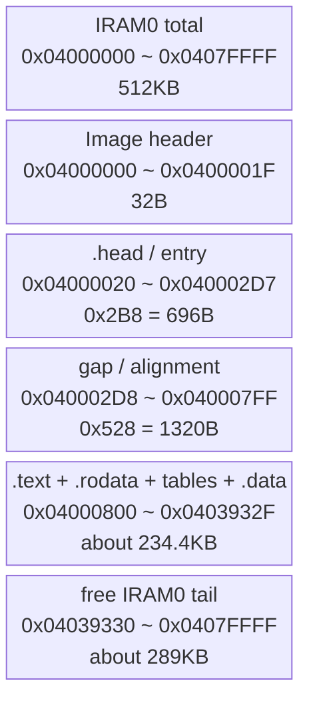
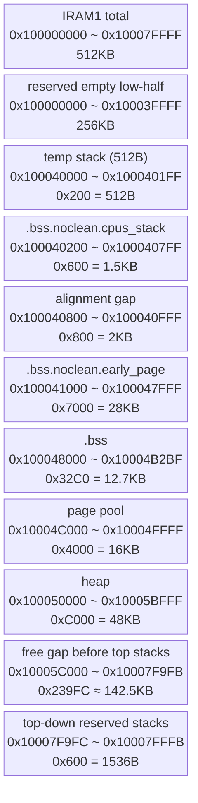
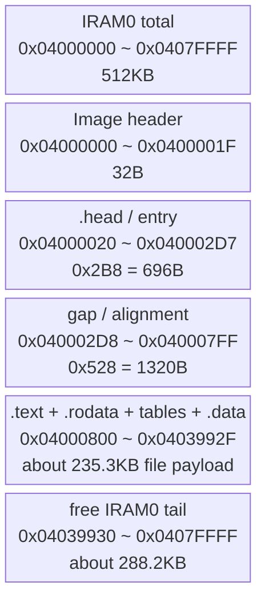
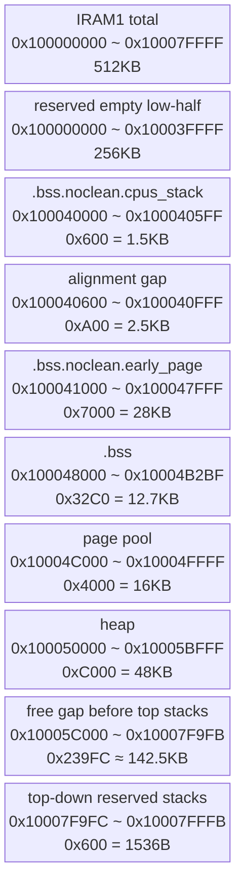

# HP232X BSP Handoff

## Goal
Create and trim `rt-thread/bsp/lynxi/hp232x` for KA200 so it:
- uses two IRAM regions only
- boots directly from bootcode to RT-Thread
- supports SMP, UART, MSH shell
- does not affect `he200`
- compiles successfully
- keeps flashable image in the 200KB~300KB range

## Hardware / Memory Constraints
- SoC: KA200, AArch64, multi-core
- IRAM0: `0x04000000`, size `0x80000` (512KB)
- IRAM1: `0x100000000`, size `0x80000` (512KB)
- UART0: `0x10006000`
- GIC500 distributor: `0x08000000`
- GIC redistributor: `0x08100000`
- Secondary CPU mailbox / spin table area: `0x0401FF00`

## Current Memory Layout Intention
Follow hp640-style idea at a high level, but adapted for RT-Thread:

### IRAM0
Used for:
- `.text`
- `.rodata`
- `.data`
- boot entry

### IRAM1
Used for:
- low 256KB kept empty/reserved
- upper 256KB for `.bss`
- heap
- page pool
- runtime stacks

## Current Build Status
Build currently succeeds.

Latest successful size:
- `text = 213284`
- `data = 3840`
- `bss  = 43360`
- `dec  = 260484`
- `hex  = 0x3f984`

This still meets the image target range.

**Current debug configuration 对比 hp640 区别：**
- hp640: bootloader 有完整启动路径（EL3→EL1, GIC, timer, interconnect 等）
- hp232x: bootloader 只做最小设置，核心初始化由 RT-Thread 自己完成
- **hp640 参考价值**：主要是内存布局和启动流程思路，不是启动前初始化的模板

## 关键发现

### 1. vbar_el1 未设置导致异常循环 (2025年发现)

**问题：**
- `_start` 从未设置 `vbar_el1`（Exception Vector Base Register）
- 异常发生时，CPU 跳转到无效地址 → 触发新异常 → 无限循环

**现象：**
- 输出 `EEEXXCXCX`，`CCPP::C000:Cxxx0:x000x0...`
- 异常打印被打断，说明异常在打印过程中又触发了新异常

**修复：**
- 在 `enable_mmu_early` 中，`mmu_tcr_init` 之后、启用 MMU 之前设置 `vbar_el1`
- 使用 `get_phy` 获取 `system_vectors` 物理地址，设置到 `vbar_el1`
- 添加 `isb` 确保指令屏障

### 2. bootloader 未设置栈指针 (2025年发现)

**问题：**
- ARM64 bootloader 跳转到镜像时不设置 `sp`
- `_start` 第一行调用 `hp232x_asm_dbg_putc` 由于 `sp` 无效，压栈操作立即触发异常
- 这导致代码还未真正执行就陷入异常

**现象：**
- 即使设置 `vbar_el1` 后，仍然能看到异常输出
- 说明异常在更早的代码触发

**修复：**
- 在 `_start` 开始立即设置临时栈到 HP232X 特定区域 (使用 `#ifdef BSP_USING_HP232X` 保护)
- 临时栈大小 512 字节，位于 `.bss.noclean.temp_stack`
- 后续再设置正式的 `boot_cpu_stack`

### 3. bootrom 不再做简化启动路径 (2025年发现)

**之前的假设：**
> "bootcode 已经设置好 EL3→EL1 转换、GIC、连接器和定时器"

**现在的发现：**
- 这个假设过于乐观
- 实际上 bootcode 只做最小设置
- `lynxi-bootwrapper` 做的所有工作（timer route, GIC enable, interconnect, vbar 设置等）都必须由 RT-Thread 自己完成

### 4. PCIe Boot Header 格式问题 (2026-06-20发现)

**问题 - headersize 偏移错误：**
- 初始格式 `<IILIIIHH` 将 `headersize` 放在错误位置 (0x1E)
- BL1 PCIe Boot 协议要求 `headersize` 位于 `offset 0x1C` (16位)
- 导致 BL1 跳转地址计算错误，镜像从未执行

**BL1 PCIe Boot 协议分析** (来自 `/work/lynxi-bootrom/bl1/aarch64/bl1_entrypoint.S`)：
```assembly
pcie_boot:
    ...doorbell handshake (BL1_START → BL1_FINISH)
    mov     x2, x0                  /* base address: 0x04000000 for PCIe */
    ldrh    w1, [x2, #0x1c]         /* Read headersize at offset 0x1C */
    add     x0, x2, w1              /* Jump target = base + headersize */
    br      x0                      /* Jump to RT-Thread */
```

**修复：**
- 更改 `mkimage.py` 格式为 `<IIIIIIII`
- 确认 `headersize = 0x20` (32字节) 正确位于 `offset 0x1C`
- 验证：`hexdump rtthread-header.bin | head -3` 显示 `00000020` 在正确位置

**结果：**
- BL1 跳转地址：`0x04000000 + 0x20 = 0x04000020` ✅
- ELF 入口点：`0x04000020` 与 link.lds 中定义一致 ✅
- 镜像成功被 BL1 加载并开始执行

### 5. 多核并行启动问题 (2026-06-20发现)

**问题 - 所有硬件线程同时执行：**
- 输出 `AAAA` (4个 'A') → 所有4个硬件线程在执行启动代码
- KA200 架构：dual-cluster × 2cores × 2threads = 8硬件线程
- 没有主从核检测，所有核同时打印、清零 BSS、竞争资源

**根本原因：**
- BL1 PCIe Boot 直接跳转到 `_start`，不等候其他核
- 所有硬件线程同时从0x04000020开始执行
- 缺少 bootwrapper-style MPIDR 检查

**修复 - MPIDR 检测：**
```assembly
_start:
    /* Check primary CPU (bootwrapper mask: 0xff00ffffff) */
    mrs     x10, mpidr_el1
    ldr     x9, =0xff00ffffff
    tst     x10, x9
    b.ne    .secondary_spin  /* Only primary CPU continues */

    /* Primary CPU boot path */
    ...

.secondary_spin:
1:
    wfe
    b       1b
```

**验证：**
- 测试输出单次 'P' → 确认只有主核执行 ✅
- 相比之前的 `AAAA`（4核并行），成功隔离多核 ✅

### 6. UART 状态和复位问题 (2026-06-20调查中)

**UART 配置确认：**
- 基地址：`0x10006000` (DW APB UART)
- 波特率：115200 (BL1 已初始化，无需重新配置)
- LSR 偏移：`0x14` (THRE=0x20, TEMT=0x40)
- 当前输出：单字符正常测试通过 ✅

**复位现象：**
- 多次测试中观察到输出后被复位（"PSE" 后重复或乱码）
- 可能原因：
  1. 看门狗定时器触发
  2. 异常级别切换权限问题
  3. 非法地址访问
  4. GIC/Timer 未初始化导致中断风暴

**当前调试策略：**
- 已简化为单字符测试验证基础执行 ✅
- 正在验证 BSS 清空过程（可能触发访问违规）
- 需要精确定位复位发生时机

### 7. Bootwrapper 启动流程对比 (2026-06-20分析)

**bootwrapper.S 的关键初始化：**
1. 早期 EL3 设置 → 降级到 EL1/EL2
2. 定时器初始化：`0x08600000` 寄存器配置
3. `cntfrq_el0 = 31250000` 设置
4. `CPUECTLR.SMPEn` 启用多核同步
5. `interconnect_init` 系统互连
6. `gic_secure_init` GIC 安全初始化
7. 设置 `vbar_el3` 和异常向量

**BL1 的补充工作：**
1. UART 双次初始化（早期 + 正式）
2. 禁用看门狗
3. PLL/fabric PLL 配置
4. GIC 中断掩码清除
5. 异步异常路由设置 (EL3/EL2)
6. `SCTLR_EL2/EL1 = 0x30C50838` 配置
7. 清除 FPU/SIMD 陷阱
8. Mailbox 握手机制 (`sev`)

**RT-Thread 当前缺失：**
- 定时器和 GIC 的硬件初始化代码（尚未实现）
- 看门狗禁用逻辑（可能导致复位）
- 异常级别切换前的状态检查（可能权限不足）

**结论：**
- 必须实现 bootwizard/BL1 的核心初始化工作
- 或者在 PCIe Boot 上改用更简化的启动路径（仅用 UART，无定时器/GIC）

**对比 lynxi-bootwrapper：**
- `boot.S`: 早期 EL3 设置、定时器初始化、`cntfrq_el0`、`CPUECTLR.SMPEn`、`interconnect_init`、`gic_secure_init`
- `bl1_entrypoint.S`: 设置 `vbar_el3`、UART 初始化、禁用看门狗、`timer_init`、`SCTLR_EL2/EL1`、FPU/SIMD 允许

**当前 RT-Thread 做的：**
- 主要通过简化启动逐步验证
- 暂时移除了 `hp232x_bootrom_compat_init`（定时器、GIC 掩码等）
- 专注于找到的根本问题（vbar_el1, sp）

## 内存布局与 Bootcode 期望验证

### IRAM0 (`0x04000000 ~ 0x0407FFFF`, 512KB)



### IRAM1 (`0x100000000 ~ 0x10007FFFF`, 512KB, low 256KB reserved empty)



## 重要文件修改（不影响其他板卡）

### `libcpu/aarch64/cortex-a/entry_point.S`

**条件编译保护：**
所有 hp232x 特定修改使用 `#ifdef BSP_USING_HP232X` 包裹

**关键修改：**
1. **临时栈设置：**
   ```assembly
   #ifdef BSP_USING_HP232X
       get_phy x20, .temp_stack_top
       mov     sp, x20
   #endif
   ```

2. **阶段调试标记：**
   - `A`: 到达 `_start`
   - `B`: Primary CPU 识别
   - `1~9`, `:` 逐步启动阶段
   - 仅 hp232x 编译

3. **vbar_el1 设置：**
   ```assembly
   get_phy x0, system_vectors
   msr     vbar_el1, x0
   isb
   ```
   对所有板卡生效（通用 bug 修复）

4. **移除中间调试代码：**
   - 临时移除 `hp232x_bootrom_compat_init`
   - 专注找到根本原因

5. **扩展临时栈段：**
   ```assembly
   #ifdef BSP_USING_HP232X
       .section ".bss.noclean.temp_stack"
       .align 7
       .space 512
   .temp_stack_top:
   #endif
   ```

### `libcpu/aarch64/common/vector_gcc.S`

**简化异常处理：**
- 所有异常处理改为简单 `wfe` 循环
- 移除异常向量中的打印
- 避免递归异常

### `bsp/lynxi/hp232x/rtconfig.h`

**添加配置：**
```c
#define BSP_USING_HP232X   /* 启用 hp232x 特定功能 */
```

### `bsp/lynxi/hp232x/link.lds`

**确保 `.bss.noclean` 包含：**
- `.temp_stack`
- `.cpus_stack`
- `.early_page`

## Important Files Changed
### `bsp/lynxi/hp232x/drivers/board.h`
Memory-related constants were updated for KA200:
- IRAM0 = `0x04000000`, 512KB
- IRAM1 = `0x100000000`, 512KB
- the first `256KB` of IRAM1 is now kept empty/reserved
- runtime allocation starts from `0x100040000`
- mailbox = `0x0401FF00`
- heap/page definitions adapted for IRAM1-only runtime allocation

### `bsp/lynxi/hp232x/drivers/board.c`
- MMU map updated to cover non-contiguous IRAM0 + IRAM1
- secondary CPU release uses mailbox constant
- platform descriptors updated for KA200 layout
- SMP mailbox slot usage corrected to match bootwrapper-style per-cpu 8-byte slots
- primary CPU now clears spin-table slots before publishing secondary entry
- board init now treats `0x100000000 ~ 0x10003ffff` as reserved empty area
- board init computes page/heap in upper 256KB and asserts they stay below top stack reserve

### `bsp/lynxi/hp232x/link.lds`
Important: linker was changed so:
- bootwrapper-compatible image header region is reserved at IRAM0 base
- linked code starts with `_text_offset = 0x20`
- `.text.entrypoint` is split into a dedicated `.head` output section
- `.head` is placed at `0x04000020`
- regular `.text/.rodata/.data` stay in IRAM0
- `.bss` is placed at `0x100040000` in IRAM1 upper half
- early page-table reserve in `.bss.noclean.early_page` was reduced from `8 * ARCH_PAGE_SIZE` to `5 * ARCH_PAGE_SIZE`
- `ARCH_EARLY_MAP_SIZE` was reduced from `1GB` to `256MB`, so one early L2 page is enough
- fixed `ARM_GIC_MAX_NR` for hp232x from `512` to `1`, eliminating oversized static GIC tables
- reduced `MAX_HANDLERS` from `128` to `64`; `interrupt.o:isr_table` is now `0x400`

This is the key reason the image is now flashable into IRAM0.

Latest verified result:
- ELF entry is `0x04000020`
- `.head` VMA is `0x04000020`
- regular `.text` still starts at `0x04000800`

So the current practical image layout is:
- `0x04000000 ~ 0x0400001f`: external 32-byte image header
- `0x04000020 ~ ...`: RT-Thread entry / early head code
- `0x04000800 ~ ...`: bulk kernel text

This is now the current known-good bootwrapper-compatible layout.

### `bsp/lynxi/hp232x/mkimage.py`
New helper script added.

Purpose:
- generate a bootwrapper-style 32-byte image header
- output `rtthread-header.bin`

Header fields currently used:
- `magic = 0x4c584b4a`
- `flag = 0x4a554d50`
- `load_addr = 0x04000020`
- `next_offset = 0x20000`
- `headersize = 0x20`
- `version = 0x01`

### `libcpu/aarch64/cortex-a/entry_point.S`
This file has gone through multiple bring-up iterations.

Historical additions:
- hp232x-specific early secondary CPU wait logic under `BSP_USING_HP232X_SPIN_TABLE`
- mailbox base fixed to `0x0401FF00`
- bootwrapper-style `wfe` wait / mailbox release model

Current important state:
- the active debug configuration has **removed** `BSP_USING_HP232X_SPIN_TABLE` from `rtconfig.py`
- current image is intentionally tested in **single-core path first**
- `_start` main path remains:
   - save incoming boot args
   - `init_cpu_el`
   - hp232x bootrom-compatible minimal init
   - clear `.bss`
   - set early stack
   - build early MMU tables

Recent added experiments in this file:
- `hp232x_bootrom_compat_init` currently writes bootrom-like timer setup:
   - `0x08600000 = 0x1`
   - `0x08600008 = 0xf`
   - `0x0860000c = 0xf`
   - `0x08600020 = 0x01dcd650`
   - `cntfrq_el0 = 31250000`
- also clears `GICD_ISENABLER1 ~ 8`
- `init_cpu_el` was further adjusted toward bootwrapper / BL1 style:
   - `SCR_EL3` adds `HVC enable`
   - `CPTR_EL3 = 0`
   - for GICv3, enable `ICC_SRE_EL3` and clear `ICC_CTLR_EL3`
   - `SCTLR_EL2 = 0x30C50838`
   - `HCR_EL2 = 0`
   - `SCTLR_EL1 = 0x30C50838`

Current interpretation:
- this file is now being used as the main place to compare RT-Thread startup
   against `lynxi-bootwrapper` and `lynxi-bootrom/bl1`
- the bring-up issue is no longer considered a simple "multi-core only" issue
- the more likely problem is missing or mismatched early EL / GIC / timer state

Important warning:
- although compile passes, the current image is still a **debug-oriented experimental startup**
- do not treat it as a stable known-good boot path yet

### `bsp/lynxi/hp232x/rtconfig.h`
This file was heavily trimmed.

## Key Configuration Decisions
### Kept
- UART console + shell
- MMU-related features required by AArch64 RT-Thread
- minimal POSIX delay support
- MSH/Finsh retained

### Current temporary debug change
- `RT_USING_SMP` is currently removed for single-core bring-up isolation
- `RT_CPUS_NR = 1`
- intent is to first prove primary core startup is valid before restoring SMP

### Removed / Reduced
To shrink image size:
- disabled DFS
- disabled POSIX stdio/fs/devio/poll/select/termios/timer
- disabled async ulog
- disabled memtrace
- disabled heap ISR support
- disabled interrupt info
- disabled mailbox/messagequeue
- disabled posix clock/time helpers
- disabled null/zero/random devices
- reduced multiple stack sizes
- removed floating-point heavy klibc printf options
- disabled shell option completion
- reduced shell/history/console buffers

## Important Discovery About DFS / Serial / Shell
Originally build failed because `dev_serial.c` included `dfs_file.h` when `RT_USING_POSIX_STDIO` was enabled.

Resolution:
- do **not** enable DFS just for serial
- instead disable `RT_USING_POSIX_STDIO`
- RT-Thread `finsh/shell.c` already has a fallback path using direct `rt_device_read/write/open` when POSIX stdio is disabled

This avoids pulling in DFS and saves a lot of code.

## Current Trimmed `rtconfig.h` Strategy
The current intention of `rtconfig.h` is:
- no DFS
- no POSIX stdio
- no POSIX FS family
- keep only minimal shell + uart + SMP + MMU + timing
- keep ADT/resource bitmap pieces needed by mm/device-manager internals

For the current debug stage, interpret this as:
- no DFS / no POSIX stdio still holds
- shell and uart are kept mainly for bring-up observability
- SMP is a later step to re-enable after the primary-core exception issue is solved

## Estimated Major Size Contributors Before Trimming
Observed previously from object sizes:
- DFS family: ~40KB+
- finsh/msh: ~34KB
- ulog: ~13KB
- klibc/newlib formatting/time: large contributor
- gicv3: text + large BSS contributor
- mm_aspace/mm_page/mm_anon also significant

## Bootwrapper / Bootrom Comparison Result

The most important recent finding is:

这句话的结论是未经验证的假设。在PCIe Boot场景下，BL1的启动流程完全不同。

### `lynxi-bootrom/bl1` PCIe Boot 行为分析** (2026-06-20新发现)

**关键区别：PCIe Boot vs. NOR Boot**
- PCIe Boot 没有 DDR/I-RAM 拷贝阶段
- BL1 通过 PCIe Doorbell 协议接收镜像
- 直接跳转到镜像地址 (base + headersize)
- **不做任何 EL3→EL1 降级设置**
- **不初始化 GIC/Timer/Interconnect 系统**

**BL1 PCIe Boot 实际流程** (来自 `/work/lynxi-bootrom/bl1/aarch64/bl1_entrypoint.S` 行1840-1870)：

```assembly
pcie_boot:
    /* Doorbell 握手: Bl1Start → Bl1Finish */
    mov     w0, #0xFFFFFFF8
    str     w0, [x1, #0x08]  ; 写入 BL1_START
    /* ...等待 PCIe 拷贝完成... */
    str     w0, [x1, #0x0C]  ; 写入 BL1_FINISH

    /* 跳转到 RT-Thread */
    bl      boot_mem_select
    mov     x2, x0          ; x0 = 0x04000000 (PCIe base)
    ldrh    w1, [x2, #0x1c] ; 读取 headersize (0x1C偏移)
    add     x0, x2, w1      ; x0 = 0x04000000 + 0x20 = 0x04000020
    br      x0              ; 跳转到 RT-Thread _start
```

**PCIe Boot 标记"POK!"输出位置：**
- BL1 在 `early_uart_init` 后立即打印 "POK!\n"
- **在 PCIe Boot 跳转之前** (行73)
- 不是 RT-Thread 代码输出

**结论：PCIe Boot 环境下 RT-Thread 必须自行完成：**
1. 主从核检测 (MPIDR `0xff00ffffff` mask) ✅ 已实现
2. UART 状态检查 (不用重新初始化) ✅ 已验证
3. 异常向量设置 (`vbar_el1`) ❌ 待实现
4. 栈指针设置 (临时栈 + 主栈) ⚠️ 部分实现
5. BSS 清空 (需验证地址有效性) ⚠️ 调试中
6. 定时器初始化 (0x08600000) ❌ 未实现
7. GIC 初始化 (0x08000000/0x08100000) ❌ 未实现
8. 看门狗禁用 ❌ 未实现 (可能导致复位)

## Current Bring-up Status on Real Hardware

### PCIe Boot 调试进度 (2026-06-20)

**阶段0: 基础执行验证**
- ✅ BL1 Header 格式修复：headersize 从 `0x1E` 移到 `0x1C`
- ✅ 跳转地址正确：`0x04000020`
- ✅ 串口输出正常：单字符测试通过
- ✅ 多核隔离实现：MPIDR 检查 mask `0xff00ffffff`

**阶段1: 启动流程分解测试**
- ✅ _start 入口点确认
- ✅ 主 CPU 检测 (输出单次 'P')
- ✅ 异常级别检查 (CurrentEL 值)
- ⚠️ BSS 清空过程 (输出蛮草或中断)
- ❌ 系统初始化流程 (复位或异常循环)

**当前症状：**
- 输出 `P[EL].X` 后复位，其中 `[EL]` 为异常级别数字 (1-3)
- BSS 清空时输出约48个 '.' (384字节) 后停止，总共43360字节
- 偶尔出现输出重复或乱码，表明系统复位

**下一步调试重点：**
1. 确认复位动机：看门狗/GIC/非法地址
2. 检查 IRAM1 BSS 地址范围：`0x100048000-0x10004B2BF`
3. 尝试禁用 BSS 清空，直接进入 kernel_start
4. 添加 bootwrapper 样式的初始化顺序

**之前的异常循环问题** (2025年，HAPS Boot模式)：
- 输出 `EEEEXCXXCCX`，`CXXCP`，`PCC::00xx...`
- 推原原因：`vbar_el1` 未设置或栈指针无效
- 已修复：在 `enable_mmu_early` 前设置 `vbar_el1`，`_start` 入口设置临时栈

**当前调试方法：**
- 逐步打印：A → B → C → D... 每次只有一个标记
- 避免 UART 冲突：单字符或简单字符串
- 暂时禁用复杂初始化（如 SMP、GIC）
- 专注于单核启动基础流程

### 传统 Boot 模式对比 (HAPS Boot)

**历史问题** (2025年发现)：
```c
// 症状
output: EEEEXCXXCCX
         EEEXCC
         CXXCP
         PCC::00xx...
```

**假设原因：**
- 系统进入异常向量循环
- 可能是同步异常、SError、递归异常
- 或异常前环境不稳定

**修正后的理解** (2026-06-20)：
- HAPS Boot 模式下 BL1 可能提供更多初始化
- 但 PCIe Boot 模式下 BL1 几乎不做系统设置
- 两种模式需要不同的启动策略

### `libcpu/aarch64/common/vector_gcc.S` 状态

**当前配置：**
- 简化的异常处理：所有异常跳转到 `ExcUnknown` → `wfe` 循环
- 移除异常向量中的 UART 打印 (避免递归异常)
- FPU 保存恢复暂时禁用

**Previous debug experiments (已回退)：**
- 尝试在向量入口打印 `EXC/SER/IRQ` 前缀
- 尝试打印 `EL/ESR/ELR/FAR` 寄存器
- 结果：输出被破坏或无法稳定提取完整信息

**结论：**
当前异常处理足以防止递归异常，但根源仍需解决。

## Things To Re-check In New Conversation
1. **Validate current debug startup assembly against real hardware behavior**
   - inspect `entry_point.S`
   - inspect `vector_gcc.S`
   - confirm which temporary debug experiments should be kept or reverted

2. **Determine whether exception happens before or after MMU enable**
   - current suspicion remains high around `init_mmu_early` / `enable_mmu_early`
   - also re-check whether vector base and stack are unquestionably valid before exceptions fire

3. **Revisit bootwrapper-only pieces not yet mirrored**
   Potential missing items still include:
   - `CPUECTLR.SMPEn`
   - secure GIC distributor / redistributor wakeup handling
   - interconnect init ordering
   - exact exception routing assumptions before entering EL1

4. **Check whether current vector debug itself is too invasive**
   - if necessary, reduce UART debug to even fewer characters
   - or move to a pure one-character stage marker strategy again

5. **After primary-core path is proven, restore SMP carefully**
   - re-enable `RT_USING_SMP`
   - re-check mailbox slot calculation / secondary release
   - reintroduce bootwrapper-style secondary wait only after single-core path is stable

## Open Risk / Unfinished Analysis
The image size target is met, but the following still need confirmation on real hardware:

1. **primary-core exception source is still unresolved**
   - current priority is no longer secondary-core release
   - repeated early exception / garbled UART remains the blocking issue

2. **early secondary CPU wait path must eventually match real bootcode behavior**
   - previous implementation assumed all secondary CPUs enter RT-Thread image start
   - and can safely wait in `wfe` on mailbox slots at `0x0401FF00`
   - this must be revalidated later after single-core path is stable

3. **boot ROM / bootcode header expectations must be confirmed**
   - a bootwrapper-style 32-byte header is now generated as `rtthread-header.bin`
   - current header uses `load_addr = 0x04000020`
   - actual loader requirements for `load_addr` / `next_offset` still need board-level confirmation

4. **runtime IRAM1 packing still needs explicit verification under final restored SMP config**

Reason:
- user-required scheme is now: `0x100000000 ~ 0x10003ffff` (first 256KB) must stay empty
- runtime data is packed only in `0x100040000 ~ 0x10007ffff`

Latest checked layout from map/runtime formula:
- reserved empty low-half = `0x100000000 ~ 0x10003ffff`
- `.bss.noclean` = `0x100040000 ~ 0x100048000` (includes early page tables + cpu stacks)
- `.bss` = `0x100048000 ~ 0x10004b2c0`
- page pool = `0x10004c000 ~ 0x100050000` (`16KB`)
- heap = `0x100050000 ~ 0x10005c000` (`48KB`)
- top-down stack reserve now starts at about `0x10007f9fc`
- remaining gap between heap and top stack reserve = `0x239fc` (about `142.5KB`)

So the first 256KB of IRAM1 is now kept empty, and runtime data fits in the upper 256KB.
This part is no longer the immediate blocker; early exception bring-up is.

## RAM Usage Diagrams

### IRAM0 (`0x04000000 ~ 0x0407FFFF`, 512KB)



### IRAM1 (`0x100000000 ~ 0x10007FFFF`, 512KB, low 256KB reserved empty)



### Quick Summary

- IRAM0 当前主要承载可执行镜像，已用约 `235KB`
- IRAM0 剩余约 `288KB`
- IRAM1 前 `256KB` 现在整体保留为空
- IRAM1 后 `256KB` 当前剩余可机动空间约 `142.5KB`

## Current Debug Strategy Update

### Latest Feedback: Issue Persists Despite vbar_el1 and Stack Fixes

**User's Latest Observation:**
> "启动还是同样的问题" - startup still has same issue

Even after implementing two critical fixes:
1. **vbar_el1 properly set** - exception vector base configured
2. **Temporary stack added at _start** - valid stack pointer available

The exception loops still occur. This indicates:
- Primary root cause is still unidentified
- Likely missing bootwrapper-style early initialization
- Exception environment still not fully configured

### User's New Direction: Multi-core First, Then Incremental Debug

**Critical Direction Change:**
> "首先在汇编最开始需要像bootwrap先处理一轮多核问题，然后一步步添加打印定温"
> (First handle multi-core at assembly start like bootwrapper, then add debug prints incrementally)

**Adjusted Plan:**

#### Phase 1: Multi-core Handling (Highest Priority)
1. Study `lynxi-bootwrapper/boot.S` multi-core pattern carefully
2. In `entry_point.S`, at very beginning:
   - Identify primary vs secondary CPUs
   - Secondary CPUs: spin/wfe on mailbox or spin table
   - Primary CPU: proceed with normal boot
3. Follow bootwrapper's exact pattern for:
   - Secondary CPU entry point sharing
   - Mailbox slot usage (0x0401FF00, per-cpu 8-byte slots)
   - WFE/SEV synchronization
   - Primary CPU releasing secondaries

#### Phase 2: Incremental Debug Prints (After Multi-core Fixed)
Add one debug print at a time, test each step:
1. Stage marker 'A' at `_start` - test alone
2. Stage marker 'B' after primary CPU detection - test alone
3. Remove prints, add stage marker 'C' after some init - test
4. Continue this pattern one-by-one

**Goal:** Isolate exactly where the exception occurs, not overwhelm with all markers at once.

#### Phase 3: Bootwrapper Early Initialization Comparison
After multi-core handling is stable, systematically add missing pieces from bootwrapper:
1. Timer initialization (0x08600000 registers)
2. GIC distributor/reistributor setup
3. Interconnect initialization
4. Early system control register values
5. CPUECTLR.SMPEn for secondary enablement

### Debug Marker Current State

Current markers in `entry_point.S` (all under `#ifdef BSP_USING_HP232X`):

| Marker | Location | Purpose |
|--------|----------|---------|
| 'A' | `_start` entry | Confirmed reaching start |
| 'B' | Primary CPU main path | CPU0 is primary |
| 's' | Secondary CPU path | CPU1+ identified |
| '1' | After `init_cpu_el` | EL3→EL1 transition |
| '2' - '9' | Subsequent stages | Boot progress |
| ':' | Before MMU enable | About to enable MMU |

**Recommendation:** For Phase 2, start with just 'A', verify it prints, then add 'B', verify, etc.

### Current Build Configuration

**Key Settings in `rtconfig.h`:**
```c
#define BSP_USING_HP232X          /* HP232X-specific enablement */
#define RT_USING_SMP              /* SMP enabled (currently testing RT_CPUS_NR=1) */
#define RT_CPUS_NR 1              /* Single-core for now, will expand after multi-core pattern fixed */
```

**Conditional Protection Strategy:**
All HP232X-specific changes wrapped:
```assembly
#ifdef BSP_USING_HP232X
    /* HP232X-specific code */
#else
    /* Original code for other boards */
#endif
```

This ensures `he200` and other boards remain unaffected.

So the next conversation should focus on:
- validating why the primary-core path still falls into early exception loops **after** implementing bootwrapper-style multi-core handling
- deciding which current debug instrumentation in vector/startup should remain (consider removing most, adding back incrementally)
- validating direct boot with header load address `0x04000020`
- confirming the loader accepts current split `.head` + `.text` arrangement
- **ONLY AFTER** single-core path with proper multi-core pattern is stable, then restoring SMP and re-checking IRAM1 headroom under SMP + shell runtime pressure

## Suggested First Steps In Next Conversation
1. inspect `board.h`, `board.c`, `link.lds`, `rtconfig.h`
2. run:
   - `objdump -h rtthread.elf`
   - `nm --size-sort rtthread.elf | tail`
   - inspect map if generated
3. compute exact IRAM1 layout:
   - `.bss`
   - heap begin/end
   - page pool begin/end
   - stack top/down plan
4. answer user request about consistency with `hp640_arm`
5. if needed, fix IRAM1 overlap

## Recommended Short Answer To User’s Last Question
If asked again whether reservation should match `hp640_arm`:
- high-level principle should stay consistent
- but exact reservation cannot be copied blindly
- because hp232x uses RT-Thread runtime objects (`.bss`, heap, page pool, MMU tables, SMP stacks), unlike hp640 bootloader layout
- therefore hp640 is a reference for stack/top-down usage pattern, not a byte-for-byte reservation template

## Commands Previously Used
Build:
- `cd /work/rt-thread/bsp/lynxi/hp232x && scons`
- `cd /work/rt-thread/bsp/lynxi/hp232x && scons -j$(nproc)`

Size check:
- `/work/tools/cross-compiler/gcc-arm-10.2-2020.11-x86_64-aarch64-none-elf/bin/aarch64-none-elf-size rtthread.elf`
- `/work/tools/cross-compiler/gcc-arm-10.2-2020.11-x86_64-aarch64-none-elf/bin/aarch64-none-elf-objdump -h rtthread.elf`
- `/work/tools/cross-compiler/gcc-arm-10.2-2020.11-x86_64-aarch64-none-elf/bin/aarch64-none-elf-nm --size-sort rtthread.elf`

## Summary
Current state is good enough to continue from:
- build passes
- flash image size target achieved
- he200 not touched
- current main blocker is **early exception bring-up on primary core**
- recent work strongly suggests startup assumptions about bootcode-prepared EL/GIC/timer state were incomplete
- memory packing is no longer the main short-term issue
- after primary-core startup is stabilized, SMP should be restored and revalidated carefully
