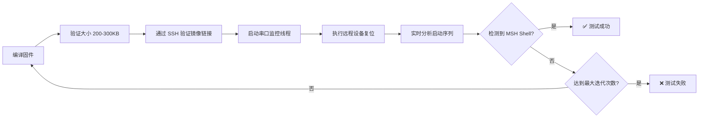

# HP232X 测试环境使用指南

## 概述

本目录提供了一个完整的自动化测试框架，用于 HP232X/KA200 RT-Thread BSP 的开发和验证。

## 环境准备

### 1. 安装 Python 依赖

```bash
cd /work/rt-thread/bsp/lynxi/hp232x
pip install -r requirements.txt
```

### 2. 检查 SSH 连接和串口设备

```bash
# 测试 SSH 连接
ssh lynxi@192.168.49.81
# 输入密码: 1

# 检查串口权限
ls -l /dev/ttyUSB0
# 如果权限不足，使用 sudo chmod 666 /dev/ttyUSB0
```

## 测试脚本说明

### quick_test.sh
用于快速单次测试的手动脚本。适合调试时快速验证。

```bash
./quick_test.sh
```

### test_framework.sh
Bash 实现的完整测试框架，支持重复迭代和日志分析。

**Usage:**
```bash
# 运行完整测试流程（默认最多 10 次迭代）
./test_framework.sh run

# 仅编译固件
./test_framework.sh compile

# 仅执行设备复位
./test_framework.sh reset

# 仅监视串口
./test_framework.sh serial

# 分析最新的测试日志
./test_framework.sh analyze
```

**Dependencies:** `sshpass`, `stty`, `timeout`.

安装依赖:
```bash
sudo apt-get install sshpass coreutils
```

### test_framework.py
Python 实现的高级测试框架，提供更强大的串口模式检测和多线程处理能力。

**Usage:**
```bash
# 运行完整测试流程
python3 test_framework.py run

# 指定迭代次数
python3 test_framework.py run -i 5

# 仅编译
python3 test_framework.py compile

# 仅监视串口
python3 test_framework.py serial

# 查看测试统计
python3 test_framework.py stats
```

**Dependencies:** `paramiko`, `pyserial`。已在 `requirements.txt` 中列出。

## 测试流程



## 当前调试状态

根据 `HANDOFF_SLIM.md`，当前系统在 BSS 清空阶段（约 384 字节）发生后复位。

**预期输出:**
```
P<EL>.X
```

**符号说明:**
- `P`: 主 CPU 进入 `_start`
- `<EL>`: CurrentEL 寄存器值 (异常级别)
- `.`: BSS 清空进度 (每个点代表 64 字节)
- `X`: 预期停止点

## 分析日志

测试产生的日志保存在 `test_logs/` 目录下，命名格式为 `test_YYYYMMDD_HHMMSS.log`。

运行 `./test_framework.sh analyze` 可以查看最后一次测试的启动字符序列分析。

## 任务进度

- [x] 编写自动化测试脚本（Bash 和 Python 版本）
- [x] 更新 `.github/skills/hp232x-testing/SKILL.md`
- [x] 准备依赖清单
- [ ] 确定复位原因（看门狗/非法地址/GIC）
- [ ] 实现 bootwizard 风格初始化
- [ ] 验证 MSH Shell 启动

## 注意事项

1. 请确保本地 `/work/rt-thread` 目录已通过 SMB 挂载到测试服务器的 `/mnt/49.20/rt-thread`。
2. 固件通过软链接 `/lib/firmware/lyn_drv/boot-wrapper.bin` 动态链接。
3. 修改源码后，编译前移除 `build` 目录以确保全量编译。