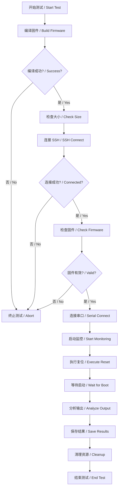

# HP232X 测试方法论 / HP232X Testing Methodology

## 概述 / Overview

本文档描述 HP232X BSP 的自动化测试方法论，包括测试环境、工具、流程和最佳实践。

This document describes the automated testing methodology for HP232X BSP, including test environment, tools, processes, and best practices.

## 测试环境 / Test Environment

### 硬件环境 / Hardware Environment

- **测试服务器 / Test Server**: 192.168.49.81
  - 帐号 / Username: `lynxi`
  - 密码 / Password: `1`
  - sudo权限密码 / sudo password: `1`

- **设备连接 / Device Connection**:
  - 设备作为 EP 设备连接到测试服务器
  - 串口 / Serial Port: `/dev/ttyUSB0`
  - 波特率 / Baudrate: 115200

- **存储映射 / Storage Mapping**:
  ```
  本地路径 / Local Path:
    /work/rt-thread/bsp/lynxi/hp232x/rtthread-header.bin

  远程路径 / Remote Path (via SMB):
    /mnt/49.20/rt-thread/bsp/lynxi/hp232x/rtthread-header.bin

  固件链接 / Firmware Link:
    /lib/firmware/lyn_drv/boot-wrapper.bin
      -> /mnt/49.20/rt-thread/bsp/lynxi/hp232x/rtthread-header.bin
  ```

### 自动化测试脚本 / Automated Test Script

#### Python测试脚本 (remote_test.py)

**位置**: `/work/rt-thread/bsp/lynxi/hp232x/remote_test.py`

**功能**:
1. 连接测试服务器 (SSH + 密码)
2. 验证固件文件和软链接状态
3. 清理串口占用进程 (pkill -9 -f 'ttyUSB0')
4. 后台启动串口监控 (20秒超时)
5. 执行设备复位 (lynd_hp run -d 0 -r wdt -o5)
6. 捕获串口输出 (实时打印)
7. 分析启动标志 (STEP1-4, msh, ERROR等)

**使用方法**:
```bash
cd /work/rt-thread/bsp/lynxi/hp232x
python3 remote_test.py
```

**标准测试流程**:
```bash
# 1. 本地编译
rm -rf build
scons -j$(nproc)

# 2. 生成PCIe Boot固件
python3 mkimage.py rtthread.bin rtthread-header.bin

# 3. 运行远程测试
python3 remote_test.py
```

### 测试环境依赖 / Test Environment Dependencies

#### Python依赖包
```bash
pip3 install pexpect paramiko
```

**安装验证**:
```bash
python3 -c "import paramiko; import pexpect; print('Dependencies OK')"
```

#### 串口访问权限

**问题**: /dev/ttyUSB0可能被其他进程占用

**解决方案**: 脚本自动执行清理命令
```bash
echo '1' | sudo -S pkill -9 -f 'ttyUSB0' 2>/dev/null || true
```

#### SSH和sudo密码处理

**自动密码传递**:
```python
# sudo密码传递
stdin, stdout, stderr = ssh.exec_command(
    f"echo '{SUDO_PASSWORD}' | sudo -S pkill -9 -f 'ttyUSB0' 2>/dev/null || true"
)
```

### 当前测试状态 / Current Test Status

**最新测试结果** (2026-06-21 14:31):

#### 进展 / Progress

**1. 栈溢出修复 (RESOLVED) ✅**
- **问题**: 临时栈512B不足以支持LOG_I格式化，导致返回地址损坏（PC:0x401fff8为doorbell地址）
- **根因分析**: 0x401fff8位于IRAM0后256KB受限区域，与spin table0x0401FF00相邻
- **解决方案**:
  - 临时栈扩大: 512B → 4KB
  - Spin table迁移: 0x0401FF00 → 0x10007F00 (IRAM1安全区域)
  - 简化LOG_I输出: 减少格式化参数
- **文件修改**:
  - `/work/rt-thread/libcpu/aarch64/cortex-a/entry_point.S:649` (.space 4096)
  - `/work/rt-thread/libcpu/aarch64/cortex-a/entry_point.S:63` (HP232X_SPIN_TABLE_BASE = 0x10007F00ULL)

**2. 页系统不兼容 (IDENTIFIED) ⚠️**
- **RT-Thread页系统假设**:
  - `shadow_mask = (1 << (RT_PAGE_MAX_ORDER + ARCH_PAGE_SHIFT - 1)) - 1`
  - 对于`RT_PAGE_MAX_ORDER=11`, `ARCH_PAGE_SHIFT=12`: `shadow_mask = 4MB`
  - 要求内存区域至少4MB连续
- **HP232X硬件限制**:
  - IRAM1仅512KB，前256KB保留，高256KB实际可用
  - 违反页系统连续4MB要求
- **异常表现**:
  - `MPR map failed with size 20000000000 (2^41字节)`
  - `rt_hw_mmu_setup`死锁/异常
- **调试输出**:
  ```
  [D/board] Init page region: 0x10004b000-0x10004f000 (size=0x4000)  # 16KB正确
  [D/board] rt_kernel_space [0x04000000 : 0xfffffffffc000000]        # 越界范围
  ```

**3. 临时解决方案 (CURRENT)**
- **跳过页系统** (`#if 0`包围`rt_page_init`和`rt_hw_mmu_setup`)
- **直接heap初始化** (`rt_system_heap_init`使用固定分配)
- **跳过GIC初始化** (依赖MMU寄存器访问)

**当前启动日志**:
```
[I/board] IRAM1: bss@100048000-10004a960 page@10004b000-10004f000 heap@10004f000-10005b000
[I/board] [board] STEP1: Skip rt_page_init - IRAM1<4MB incompatible with shadow_mask
[I/board] [board] STEP2: Direct heap init without paging
[I/board] [board] STEP3: Skip rt_hw_mmu_setup - requires page system
[I/board] [board] Heap: 0x10004f000-0x10005b000 (48KB)
[I/board] [board] About to call rt_interrupt_init
EXC PC:0x000000000400cf28 (arm_gic_cpu_init - 系统寄存器访问需MMU)
```

#### 阻塞问题 / Blockers

| 问题 / Issue | 根因 / Root Cause | 影响 / Impact | 状态 / Status |
|-------------|-------------------|--------------|--------------|
| 栈溢出 | 临时栈512B太小 | 返回地址损坏，PC指向doorbell | **解决** ✅ |
| MPR size错误 | IRAM1高256KB < shadow_mask(4MB) | 页系统无法初始化 | **确认阻塞** 🔴 |
| GIC系统寄存器异常 | 无MMU无法访问ICC_*_EL1 | 中断初始化失败 | **依赖页系统** 🟡 |
| 无MMU多核 | spin table迁移完成，但需页系统支持 | SMP无法启动 | **依赖页系统** 🟡 |

#### 下一步计划 / Next Steps

**选项A: 定制页系统适配小内存**
1. 修改`shadow_mask`计算逻辑支持256KB区域
2. 调整`RT_PAGE_MAX_ORDER`从11降至6 (256KB/4KB=64页)
3. 实现跨4GB边界的页表分配
4. 风险: 需深度修改RT-Thread核心

**选项B: 简化为无页系统单核**
1. 保持当前48KB heap直接分配
2. 跳过GIC/Timer，使用putDebug输出
3. 移除SMP/multi-threading
4. 适用: 实时要求高、功能简化场景

**推荐路径**: 评估嵌入式需求后选择A或B

---

### 历史问题记录 / Historical Issues

**问题: PCIe Boot Header (FIXED 2026-06-21)**
- 固件未正确加载，无法启动
- 修复: `mkimage.py` 在offset 0x1C设置headersize=0x20

**问题: rt_page_init MPR size异常 (IDENTIFIED)**
- 错误信息: `MPR map failed with size 20000000000 at (nil)`
- 状态: 根因已分析，需要设计解决方案

**问题: rt_hw_mmu_setup地址越界 (IDENTIFIED)**
- 跨4GB边界的IRAM0/IRAM1导致页表溢出
- 状态: 与页系统不兼容同一根因

**问题: PC=0x401fff8异常 (FIXED 2026-06-21)**
- 栈溢出导致返回地址损坏
- 修复: 扩大临时栈到4KB，spin table迁移到安全区域
- 发生时资源: LOG_I格式化长十六进制字符串时
- 初步结论: 可能是printf/LOG_I对长格式化字符串的缓冲区溢出

## 软件环境 / Software Environment

- **RT-Thread 版本**: 当前开发版本
- **交叉编译工具链**: aarch64-none-elf-gcc
- **Python 版本**: 3.6+
- **Python 依赖**: 见 `requirements.txt`

## 自动化测试脚本 / Automated Test Script

### 脚本架构 / Script Architecture

主脚本 `test_hp232x.py` 实现了完整的自动化测试流程:

The main script `test_hp232x.py` implements the complete automated test workflow:

```
┌─────────────────────────────────────────────────────────────┐
│                     HP232XTestRunner                         │
│  (主测试控制器 / Main Test Controller)                        │
└─────────────────────────────────────────────────────────────┘
                            │
         ┌──────────────────┼──────────────────┐
         │                  │                  │
         ▼                  ▼                  ▼
┌─────────────────┐ ┌─────────────┐ ┌──────────────────────┐
│ HP232XBuilder   │ │ SSHClient   │ │ SerialMonitor        │
│ (固件编译/       │ │ (SSH 连接/  │ │ (串口监控/            │
│  Build)         │ │  Remote)    │ │  Output Capture)     │
└─────────────────┘ └─────────────┘ └──────────────────────┘
         │                  │                  │
         ▼                  ▼                  ▼
    编译/清理        连接服务器          监控串口
    Build/Clean     SSH Connect       Monitor Serial
```

### 核心类 / Core Classes

#### 1. HP232XBuilder (编译器 / Builder)

```python
builder = HP232XBuilder(bsp_dir, logger)
builder.clean()
success, output = builder.build()
size_ok, size_kb = builder.check_binary_size()
```

**功能 / Functionality**:
- 清理构建目录 / Clean build directory
- 并行编译固件 / Parallel build firmware
- 检查二进制大小 / Check binary size

**目标范围 / Target Range**: 200-300KB

#### 2. SSHClient (SSH 客户端)

```python
ssh_client = SSHClient(SERVER_CONFIG, logger)
ssh_client.connect()
ssh_client.check_firmware_link()
ssh_client.check_firmware_file()
ssh_client.reset_device()
```

**功能 / Functionality**:
- 连接测试服务器 / Connect to test server
- 验证固件链接 / Verify firmware symlink
- 检查挂载文件 / Check mounted file
- 执行设备复位 / Execute device reset

**关键命令 / Key Commands**:
- 检查链接: `ls -l /lib/firmware/lyn_drv/boot-wrapper.bin`
- 复位设备: `sudo lynd_hp run -d 0 -r wdt -o5`

#### 3. SerialMonitor (串口监控器)

```python
monitor = SerialMonitor(SERIAL_CONFIG, logger)
monitor.connect()
monitor.start_monitoring(timeout=60)
analysis = monitor.analyze_output()
output = monitor.get_output()
```

**功能 / Functionality**:
- 连接串口设备 / Connect to serial port
- 实时捕获输出 / Real-time output capture
- 检测启动模式 / Detect boot patterns
- 分析启动结果 / Analyze boot results

**检测模式 / Detection Patterns**:
- Shell 提示: `msh />`
- 堆信息: `Memory.*heap:\s+(\d+)\s+KB`
- GIC 初始化: `GIC.*init`
- 多核启动: `cpu\[\d+\]: running`
- 错误模式: `ERROR`, `panic`, `Exception`, `Fault`

#### 4. TestLogger (日志管理器)

```python
logger = TestLogger(log_dir='logs')
logger.info('信息消息')
logger.warning('警告消息')
logger.error('错误消息')
logger.success('成功消息')
logger.serial_log(serial_line)
logger.save_serial_output(complete_output)
```

**功能 / Functionality**:
- 控制台输出 / Console output
- 日志文件记录 / Log file recording
- 串口数据保存 / Serial data preservation
- 测试会话管理 / Test session management

**输出文件 / Output Files**:
- `logs/test_{timestamp}.log`: 主日志文件
- `logs/serial_{timestamp}.log`: 串口原始数据
- `logs/boot_output_{timestamp}.txt`: 完整输出
- `logs/result_{timestamp}.json`: 结构化结果

## 测试流程 / Test Workflow

### 完整测试流程 / Complete Test Workflow



### 详细步骤 / Detailed Steps

#### 步骤 1: 编译固件 / Build Firmware

```bash
cd /work/rt-thread/bsp/lynxi/hp232x
rm -rf build  # 清理 / Clean
scons -j$(nproc)  # 并行编译 / Parallel build
```

**验证 / Verification**:
- `aarch64-none-elf-size rtthread.elf`: 查看段大小
- `ls -lh rtthread-header.bin`: 查看总大小
- 目标: 200-300KB

#### 步骤 2: 连接测试服务器 / Connect to Test Server

```python
ssh_client.connect()  # 192.168.49.81: lynxi/1
```

**验证 / Verification**:
- 成功建立 SSH 连接
- 执行简单命令测试权限

#### 步骤 3: 验证固件文件 / Verify Firmware File

```python
ssh_client.check_firmware_link()  # 检查软链接 / Check symlink
ssh_client.check_firmware_file()  # 检查文件 / Check file
```

**验证 / Verification**:
- 链接正确指向挂载目录
- 文件存在且大小正确
- SMB 挂载正常

#### 步骤 4: 启动串口监控 / Start Serial Monitoring

```python
serial_monitor.connect()  # /dev/ttyUSB0 @ 115200
serial_monitor.start_monitoring(timeout=60)
```

**说明 / Note**:
- 清空串口缓冲区以避免旧数据
- 在后台线程中监控
- 超时自动停止

#### 步骤 5: 执行复位并监控 / Execute Reset and Monitor

```python
ssh_client.reset_device()  # sudo lynd_hp run -d 0 -r wdt -o5
# 等待监控完成 / Wait for monitoring completion
analysis = serial_monitor.analyze_output()
```

**验证 / Verification**:
- 复位命令成功执行
- 收到串口输出数据
- 检测到启动模式或错误

#### 步骤 6: 分析结果 / Analyze Results

```python
analysis = {
    'total_lines': N,
    'boot_success': True/False,
    'detected_features': ['MSH Shell 启动成功', 'GIC 初始化', ...],
    'errors': ['检测到错误模式: ...']
}
```

**成功标准 / Success Criteria**:
- ✅ 检测到 `msh />` 提示
- ✅ 初始化进程堆 (200-300 KB)
- ✅ GIC 中断控制器初始化
- ✅ 多核启动 (8 个 CPU)
- ✅ 无错误或异常

## 使用方法 / Usage

### 标准测试循环 / Standard Test Loop

```bash
# 进入BSP目录
cd /work/rt-thread/bsp/lynxi/hp232x

# 完整测试循环 (一键命令)
rm -rf build && scons -j$(nproc) && \
python3 mkimage.py rtthread.bin rtthread-header.bin && \
python3 remote_test.py
```

### 手动测试步骤 / Manual Testing Steps

#### 步骤1: 编译固件 / Build Firmware
```bash
rm -rf build                    # 清理构建目录
scons -j$(nproc)                # 并行编译
```

**验证项**:
- ✓ 编译无错误
- ✓ rtthread.elf生成
- ✓ 镜像大小200-300KB

**验证命令**:
```bash
/work/tools/cross-compiler/gcc-arm-10.2-2020.11-x86_64-aarch64-none-elf/bin/aarch64-none-elf-size rtthread.elf
```

#### 步骤2: 生成PCIe Boot固件 / Generate PCIe Boot Firmware
```bash
python3 mkimage.py rtthread.bin rtthread-header.bin
```

**验证项**:
- ✓ rtthread-header.bin生成
- ✓ offset 0x1C = 0x20 (32字节)

**验证命令**:
```bash
hexdump rtthread-header.bin | head -3
# 预期输出: offset 0x1C 显示 00000020
```

#### 步骤3: 验证远程状态 / Verify Remote Status
```bash
# SSH连接并检查
ssh lynxi@192.168.49.81 <<'EOF'
  # 检查固件文件
  ls -lh /mnt/49.20/rt-thread/bsp/lynxi/hp232x/rtthread-header.bin

  # 检查软链接
  ls -l /lib/firmware/lyn_drv/boot-wrapper.bin
EOF
```

#### 步骤4: 运行自动化测试 / Run Automated Test
```bash
python3 remote_test.py
```

**预期输出**:
```
=== HP232X Automated Test ===
[1] Connecting to server...
    ✓ Connected
[2] Verifying firmware file...
    Firmware: -rwxr-xr-x 1 lynxi lynxi 214KB
    Symlink: lrwxrwxrwx 1 root root 57
[3] Cleaning serial port...
[4] Starting serial monitor (20s timeout)...
[5] Resetting device...
    ✓ Reset command executed
[6] Capturing serial output...
<串口实时输出>
[7] Analysis Results:
    ✓ rt_page_init reached
    ✓ rt_hw_mmu_setup completed
    ✓ Shell detected
=== Test Complete ===
```

### 基本使用 / Basic Usage

```bash
# 安装依赖 / Install dependencies
pip install -r requirements.txt

# 运行测试 / Run test
python3 test_hp232x.py
```

### 高级选项 / Advanced Options

```bash
# 不清理构建目录 / Do not clean build directory
python3 test_hp232x.py --no-clean

# 自定义日志目录 / Custom log directory
python3 test_hp232x.py --log-dir custom_logs

# 指定并行任务数 / Specify parallel jobs
python3 test_hp232x.py --parallel 4
```

### 程序化使用 / Programmatic Usage

```python
from test_hp232x import HP232XTestRunner

# 创建测试运行器 / Create test runner
runner = HP232XTestRunner()

# 运行测试 / Run test
result = runner.run_test(clean_build=True)

# 检查结果 / Check result
if result['boot']['success']:
    print("测试成功!")
    for feature in result['boot']['features']:
        print(f"  - {feature}")
else:
    print("测试失败!")
    print("错误:", result['boot']['errors'])
```

## 调试技巧 / Debugging Tips

### 1. 手动验证编译 / Manual Build Verification

```bash
cd /work/rt-thread/bsp/lynxi/hp232x

# 清理并编译 / Clean and build
rm -rf build
scons -j1  # 单线程，便于查看错误 / Single thread for error visibility

# 检查大小 / Check size
/work/tools/cross-compiler/gcc-arm-10.2-2020.11-x86_64-aarch64-none-elf/bin/aarch64-none-elf-size rtthread.elf
```

### 2. 手动验证 SSH 连接 / Manual SSH Verification

```bash
# 测试连接 / Test connection
ssh lynxi@192.168.49.81
# 密码: 1

# 检查软链接 / Check symlink
ls -l /lib/firmware/lyn_drv/boot-wrapper.bin

# 检查文件 / Check file
ls -lh /mnt/49.20/rt-thread/bsp/lynxi/hp232x/rtthread-header.bin

# 测试复位命令 / Test reset command
sudo lynd_hp run -d 0 -r wdt -o5
```

### 3. 手动监控串口 / Manual Serial Monitoring

```bash
# 使用 minicom / Using minicom
minicom -D /dev/ttyUSB0 -b 115200

# 或使用 screen / Or using screen
screen /dev/ttyUSB0 115200

# 或使用 cat / Or using cat
cat /dev/ttyUSB0
```

### 4. 验证固件 Header / Verify Firmware Header

```bash
# 查看前 32 字节 / View first 32 bytes
hexdump rtthread-header.bin | head -3

# 预期结果 / Expected result:
# offset 0x1C 应该是 0x20 (32)
# 00000020: 00000000 00000000 00000000 00000000 20
```

### 5. 分析失败原因 / Analyze Failure Causes

**常见失败模式 / Common Failure Patterns**:

1. **编译失败 / Build Failure**:
   - 检查 `logs/test_*.log` 查看错误输出
   - 手动运行 `scons -j1` 查看详细错误

2. **SSH 连接失败 / SSH Connection Failure**:
   - 检查网络连接: `ping 192.168.49.81`
   - 检查 SSH 服务状态
   - 验证用户名和密码

3. **固件文件无效 / Invalid Firmware File**:
   - 检查 SMB 挂载: `mount | grep rt-thread`
   - 验证软链接指向正确文件
   - 检查文件权限

4. **串口连接失败 / Serial Connection Failure**:
   - 检查串口设备: `ls /dev/ttyUSB*`
   - 验证 USB 串口权限
   - 测试串口通信: `echo "test" > /dev/ttyUSB0`

5. **启动失败 / Boot Failure**:
   - 查看 `logs/boot_output_*.txt` 分析输出
   - 检查错误模式 (ERROR, panic, Exception)
   - 对比成功启动的输出日志

## 测试任务 / Test Tasks

### 任务 1: 完成多核启动 / Task 1: Multi-core Boot

**目标 / Goal**: 支持 GIC，多线程，启动到 shell
**目标 / Target**: Support GIC, multi-threading, boot to shell

**验证点 / Verification Points**:
- [ ] 8 个硬件线程正确启动
- [ ] GIC 中断控制器初始化成功
- [ ] 次核正确释放并进入 WFE 循环
- [ ] MSH Shell 正常可用
- [ ] 多核任务调度工作正常

**测试方法 / Test Method**:
```python
# 运行测试 / Run test
result = run_test()

# 验证多核启动 / Verify multi-core boot
assert '多核启动: 8 个 CPU' in result['boot']['features']
assert 'GIC 中断控制器初始化' in result['boot']['features']
assert result['boot']['success'] == True
```

### 任务 2: 不影响其他板卡 / Task 2: No Impact on Other Boards

**目标 / Goal**: 源码修改不影响 he200 等其他板卡的编译
**目标 / Target**: Code changes do not affect compilation of other boards like he200

**验证点 / Verification Points**:
- [ ] HP232X 特定代码使用 `#ifdef BSP_USING_HP232X` 保护
- [ ] he200 BSP 可以正常编译
- [ ] 其他 BSP 编译不受影响

**测试方法 / Test Method**:

```bash
# 测试 HP232X 编译 / Test HP232X build
cd /work/rt-thread/bsp/lynxi/hp232x
rm -rf build
scons -j$(nproc)
# 应该成功 / Should succeed

# 测试 he200 编译 / Test he200 build
cd /work/rt-thread/bsp/lynxi/he200
rm -rf build
scons -j$(nproc)
# 应该成功 / Should succeed
```

### 任务 3: 内存约束 / Task 3: Memory Constraints

**目标 / Goal**: IRAM0 后 256KB 和 IRAM1 前 256KB 不能使用
**目标 / Target**: Last 256KB of IRAM0 and first 256KB of IRAM1 cannot be used

**内存布局 / Memory Layout**:

```
IRAM0 (512KB @ 0x04000000):
  0x04000000 - 0x040002D7: .head (696B)
  0x04000800 - 0x0403AFFF: .text + .rodata + .data (~235KB)
  0x0403B000 - 0x0407FFFF: 剩余空间 / Reserved (约288KB) ✅

IRAM1 (512KB @ 0x100000000):
  0x100000000 - 0x10003FFFF: 保留空区 / Reserved (256KB) ✅
  0x100040000 - 0x10007FFFF: 使用空间 / Used (256KB)
    0x100040000 - 0x1000405FF: cpu stacks (1.5KB)
    0x100041000 - 0x100047FFF: page tables (28KB)
    0x100048000 - 0x10004B2BF: .bss (12.7KB)
    0x10004C000 - 0x10004FFFF: page pool (16KB)
    0x100050000 - 0x10005BFFF: heap (48KB)
    0x10005C000 - 0x10007F9FB: 空闲 / Free (约142.5KB)
```

**验证方法 / Verification Method**:

```bash
# 查看段布局 / View section layout
aarch64-none-elf-objdump -h rtthread.elf

# 关键检查 / Key checks:
# .text 段在 IRAM0 范围内 / .text section in IRAM0 range
# .bss 段在 IRAM1 后 256KB 范围内 / .bss section in IRAM1 upper 256KB
# 没有段使用 IRAM1 前 256KB / No sections in IRAM1 lower 256KB
```

## 故障排查 / Troubleshooting

### 常见问题 / Common Issues

#### 问题 1: 编译失败 / Issue 1: Build Failure

**症状 / Symptoms**:
```
ERROR: Build failed with exit code 1
```

**可能原因 / Possible Causes**:
- 交叉编译工具链未安装或路径错误
- Python 版本不兼容
- SCons 配置错误

**解决方案 / Solution**:
```bash
# 检查工具链 / Check toolchain
which aarch64-none-elf-gcc

# 检查 Python 版本 / Check Python version
python3 --version

# 手动编译 / Manual build
scons -j1
```

#### 问题 2: SSH 连接超时 / Issue 2: SSH Connection Timeout

**症状 / Symptoms**:
```
ERROR: SSH connection failed: timeout
```

**可能原因 / Possible Causes**:
- 网络不可达
- SSH 服务未启动
- 防火墙阻止

**解决方案 / Solution**:
```bash
# 测试网络 / Test network
ping 192.168.49.81

# 手动 SSH 连接 / Manual SSH connection
ssh -v lynxi@192.168.49.81
```

#### 问题 3: 串口无输出 / Issue 3: No Serial Output

**症状 / Symptoms**:
```
WARNING: 监控超时，未检测到 shell 提示
Total lines: 0
```

**可能原因 / Possible Causes**:
- 串口设备路径错误
- 权限不足
- 波特率不匹配

**解决方案 / Solution**:
```bash
# 检查串口设备 / Check serial device
ls /dev/ttyUSB*

# 添加用户到 dialout 组 / Add user to dialout group
sudo usermod -aG dialout $USER
# 需要重新登录 / Need to re-login

# 手动测试串口 / Manual test serial
minicom -D /dev/ttyUSB0 -b 115200
```

#### 问题 4: 固件大小超出范围 / Issue 4: Firmware Size Out of Range

**症状 / Symptoms**:
```
WARNING: 固件大小超过目标 (200-300KB)
Firmware size: 350.50 KB (358912 bytes)
```

**可能原因 / Possible Causes**:
- 未禁用不必要的组件
- 调试信息未去除
- 代码未优化

**解决方案 / Solution**:
```bash
# 检查 rtconfig.h / Check rtconfig.h
# 确保禁用不必要功能 / Ensure unnecessary features disabled:
#   RT_USING_DFS
#   RT_USING_POSIX
#   RT_USING_LWIP
#   RT_USING_FINSH

# 分析符号表 / Analyze symbol table
aarch64-none-elf-nm --size-sort rtthread.elf | tail -20

# 优化编译选项 / Optimize build options
# 在 RT-Thread 配置中启用优化 / Enable optimization in config
```

## 最佳实践 / Best Practices

### 1. 迭代开发 / Iterative Development

```python
# 原型代码，添加调试标记 / Prototype code with debug markers
print('P', end='')  # 进入 _start
print('A', end='')  # 检查 CurrentEL
print('.', end='')  # BSS 清空进度

# 测试基本执行 / Test basic execution
# 移除调试标记后提交 / Remove debug markers before commit
```

### 2. 日志分析 / Log Analysis

```python
# 保存测试结果 / Save test results
result = run_test()

# 失败时，对比成功和失败的日志 / On failure, compare success and failure logs
if not result['boot']['success']:
    print("失败日志 / Failure log:")
    print(result['boot_output'])

    # 查找错误模式 / Find error patterns
    if 'ERROR' in result['boot_output']:
        lines = result['boot_output'].split('\n')
        for line in lines:
            if 'ERROR' in line:
                print(line)
```

### 3. 测试隔离 / Test Isolation

```python
# 每次测试前清理 / Clean before each test
builder.clean()
serial_monitor.connect()
serial_monitor.clear_buffer()  # 清空缓冲区 / Clear buffer
```

### 4. 失败重试 / Failure Retry

```python
# 自动重试机制 / Auto retry mechanism
max_retries = 3
for attempt in range(max_retries):
    result = run_test()
    if result['boot']['success']:
        break
    elif attempt < max_retries - 1:
        time.sleep(5)  # 等待 before retry
```

### 5. 性能优化 / Performance Optimization

```python
# 并行编译 / Parallel build
builder.build(parallel_jobs=str(os.cpu_count()))

# 异步监控 / Asynchronous monitoring
monitor_thread = threading.Thread(
    target=monitor.start_monitoring,
    daemon=True
)
monitor_thread.start()
```

## 扩展功能 / Extended Features

### 自定义启动模式检测 / Custom Boot Pattern Detection

```python
# 在 BOOT_MARKERS 中添加新模式 / Add new pattern in BOOT_MARKERS
BOOT_MARKERS = {
    # ... 现有标记 / existing markers ...
    'custom_pattern': r'YourCustomPattern',
}

# 在 SerialMonitor._process_line 中处理 / Handle in SerialMonitor._process_line
def _process_line(self, line):
    # ... 现有处理 / existing processing ...
    if re.search(BOOT_MARKERS['custom_pattern'], line):
        self.logger.info('检测到自定义模式 / Custom pattern detected')
```

### 多设备测试 / Multi-Device Testing

```python
# 修改配置以支持多个设备 / Modify config to support multiple devices
DEVICES = [
    {'name': 'dev1', 'serial': '/dev/ttyUSB0'},
    {'name': 'dev2', 'serial': '/dev/ttyUSB1'},
]

# 对每个设备运行测试 / Run test for each device
results = []
for device in DEVICES:
    serial_config['port'] = device['serial']
    result = run_test()
    results.append(result)

# 对比结果 / Compare results
for device, result in zip(DEVICES, results):
    print(f"{device['name']}: {'成功' if result['boot_success'] else '失败'}")
```

### 自动报告生成 / Auto Report Generation

```python
# 生成 HTML 报告 / Generate HTML report
def generate_html_report(result):
    html = f"""
    <html>
    <head><title>HP232X 测试报告 / Test Report</title></head>
    <body>
        <h1>测试结果 / Test Result</h1>
        <p>编译状态 / Build Status: {result['build']['success']}</p>
        <p>启动状态 / Boot Status: {result['boot']['success']}</p>
        <h2>特性 / Features</h2>
        <ul>
    """
    for feature in result['boot']['features']:
        html += f"<li>{feature}</li>"
    html += "</ul></body></html>"
    return html

# 保存报告 / Save report
with open('report.html', 'w') as f:
    f.write(generate_html_report(result))
```

## 参考资源 / References

- **HP232X BSP Handoff**: `/work/rt-thread/bsp/lynxi/hp232x/HANDOFF_SLIM.md`
- **测试环境**: `/work/rt-thread/bsp/lynxi/hp232x/Test_env.md`
- **RT-Thread 文档**: https://www.rt-thread.io/document/site/
- **Python SSH 文档**: https://docs.paramiko.org/
- **Python Serial 文档**: https://pyserial.readthedocs.io/

## 总结 / Summary

本测试方法论提供了完整的自动化测试框架，支持:

This testing methodology provides a complete automated testing framework that supports:

- ✅ 自动化固件编译 / Automated firmware build
- ✅ 远程设备管理 / Remote device management
- ✅ 实时串口监控 / Real-time serial monitoring
- ✅ 智能启动分析 / Intelligent boot analysis
- ✅ 结构化日志记录 / Structured logging
- ✅ 失败诊断支持 / Failure diagnosis support
- ✅ 可扩展架构 / Extensible architecture

通过遵循此方法论，可以高效地完成 HP232X BSP 的测试和验证。

By following this methodology, you can efficiently complete the testing and verification of HP232X BSP.