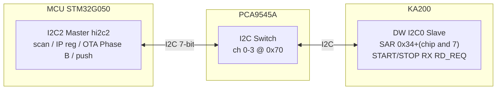
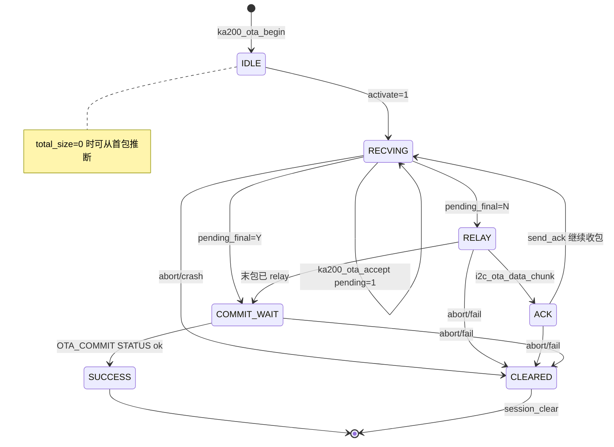
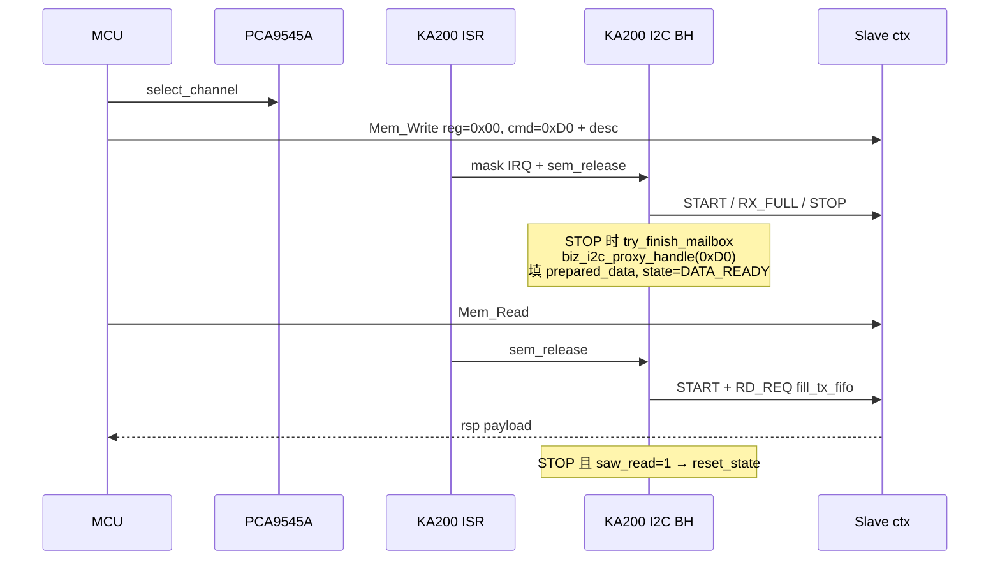
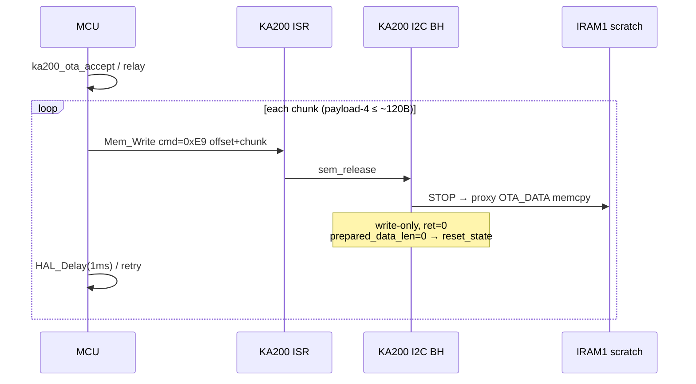
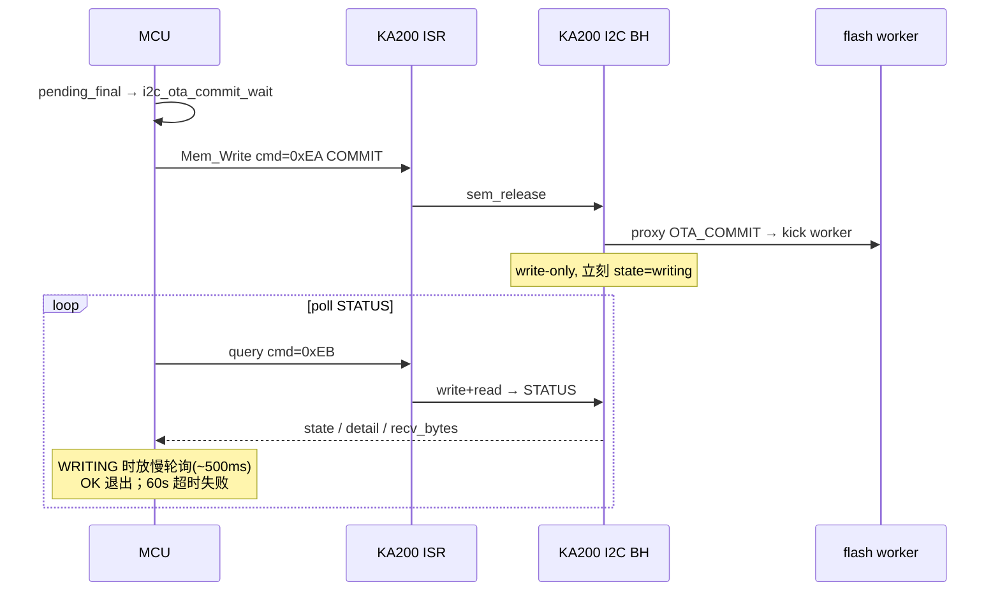
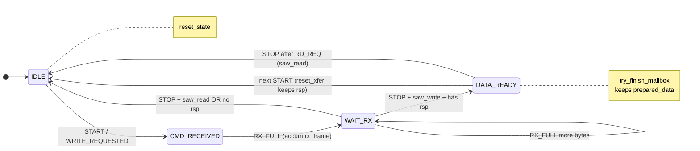
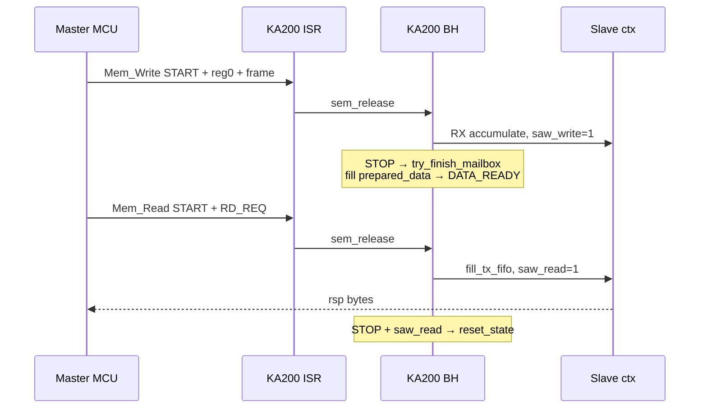
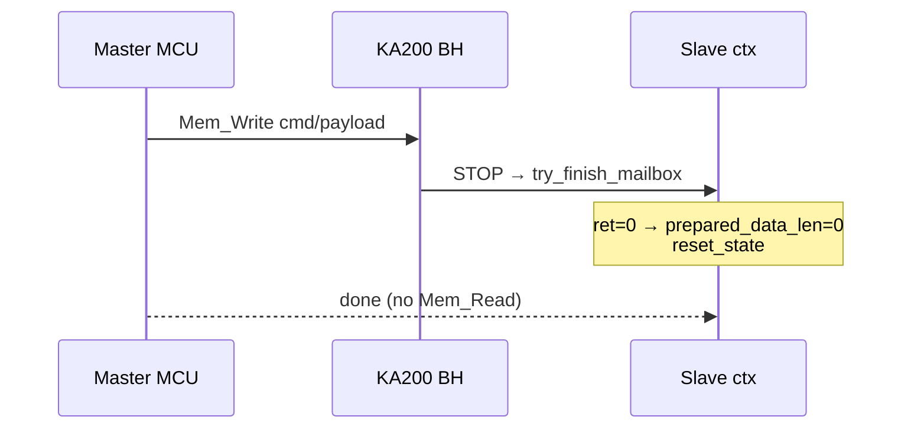
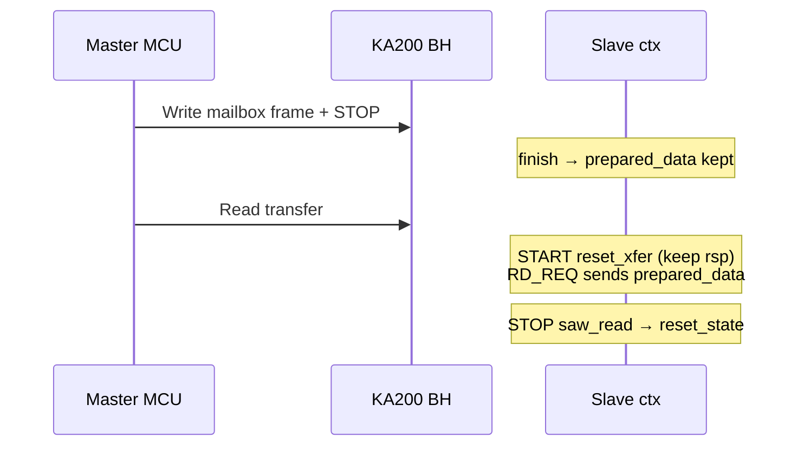

# KA200 I2C 交互全流程分析（MCU Master ↔ KA200 Slave）

> 范围：MCU I2C2 Master (PCA9545A mux) ↔ KA200 DW I2C0 Slave  
> MCU 端：`Lynchip_mcu_HP2320/HP2320_APP/` | KA200 端：`lynxi-rtt/bsp/lynxi/hp232x/drivers/drv_i2c.c`

---

## 1. 整体架构



- I2C2 固定地址：PCA9545A = 0x70, KA200 = 0x34..0x3B (7-bit)
- PCA9545A 通道选择：单字节写 0x01~0x08 启用对应 I2C 子总线
- KA200 从机地址：由 GPIO 多路复用器决定，启动时通过 `drv_i2c_mcu_resolve_addr()` 自动探测

---

## 2. MCU 端 I2C Master 状态机分析

MCU 侧没有显式的"状态机"，但通过函数调用链隐式实现了多层协议状态管理：

### 2.1 I2C 传输层状态（HAL_I2C 超时/重试）

所有 I2C 操作通过以下封装函数：

```c
// ka200_i2c_cmd.c
HAL_StatusTypeDef lynxi_mcu_ka200_i2c_mem_read(uint8_t addr7, uint8_t reg, uint8_t *data, uint16_t len);
HAL_StatusTypeDef lynxi_mcu_ka200_i2c_mem_write(uint8_t addr7, uint8_t reg, const uint8_t *data, uint16_t len);
HAL_StatusTypeDef lynxi_mcu_ka200_i2c_mailbox_write(uint8_t addr7, uint8_t cmd_id, const uint8_t *payload, uint16_t payload_len);
HAL_StatusTypeDef lynxi_mcu_ka200_i2c_query_payload(...);  // write + read 完整事务
```

**超时设置**：
- 普通命令：`MCU_I2C_CMD_TIMEOUT`（未定义具体值，约 100-200ms）
- OTA DATA 写：硬编码 200ms（`i2c_ota_data_chunk()` 中的 2500ms 软超时）
- OTA COMMIT 轮询：60s 总超时

**重试机制**：
- `i2c_ota_data_chunk()`：最多 `MCU_KA200_OTA_RETRY`（默认 2 次）+ `ka200_recover()`（I2C 重初始化）
- `i2c_ota_commit_wait()`：5 次尝试写入 + 3 次 fallback query，失败后 poll STATUS

### 2.2 OTA 会话状态机（ka200_ota_relay.c）

这是 MCU 侧最复杂的状态管理，对应 `ka200_ota_session_t` 结构：

| 字段 | 含义 |
|------|------|
| `active` | 会话是否激活（OTA 进行中） |
| `pending` | 是否有待 relay 的数据块 |
| `pending_final` | 当前 block 是否是最后一个包 |
| `use_bitmap` | 是否使用位图确认 |
| `expected_seq_lo` / `expected_abs` | 期望的序列号/绝对序号 |
| `recv_bitmap` | 已接收包的位图 |
| `payload` | 待发送的数据指针 |
| `remain` | 待发送剩余字节数 |
| `offset` | OTA 目标偏移 |

**状态转换图**：



**关键函数**：
- `ka200_ota_begin()`：初始化会话，若 total_size>0 则立即执行 OPEN
- `ka200_ota_accept()`：验证 MCU 上层收到的 OTA 数据包，设置 pending
- `ka200_ota_relay()`：将 pending 数据通过 I2C 发送到 KA200，最后 COMMIT
- `ka200_ota_is_active()` / `ka200_ota_pending_is_final()`：状态查询

---

## 3. KA200 I2C Slave 状态机回顾

详见本文 §7。核心总结：

- **状态**：IDLE → CMD_RECEIVED → WAIT_RX → (DATA_READY 或 IDLE)
- **关键标志**：`saw_read` / `saw_write` / `prepared_data_len`
- **线程模型**：ISR 仅 mask + `sem_release`；BH 调 `drv_i2c_irq_process()`（含 STOP 上 `try_finish_mailbox` → `biz_i2c_proxy_handle`）
- **要点**：RX 中途不跑 handler（防 SCL stretch）；`reset_xfer` 保留 `prepared_data` 以支持 Write→Mem_Read

---

## 4. 完整交互流程分析

### 4.1 情景 1：IP 寄存器读（MCU → KA200 查询）



**耗时要点**：
- I2C 写（命令 + 描述符）：最多 9 字节（4 字节头 + 5 字节 payload），100kHz 约 0.72ms
- KA200 BH：`biz_i2c_proxy_handle()` 读 MMIO，通常很短
- I2C 读响应：100kHz 约 0.4ms/字节
- 总耗时典型：2–5ms（含 HAL 内部延时）

### 4.2 情景 2：OTA Data 阶段（MCU → KA200 写入）



**关键设计**：
- `i2c_ota_data_chunk()` 有限重试 + `ka200_recover()`（I2C reinit）
- RX 过程中**不**跑 handler；仅 STOP 后在 BH 里 `biz_i2c_proxy_handle()`，避免 SCL stretch
- 数据落 `IRAM1_HOST_SCRATCH`，COMMIT 前不写 Flash

### 4.3 情景 3：OTA Commit（MCU → KA200 触发写入 Flash）



**注意**：COMMIT=`0xEA`，STATUS=`0xEB`。COMMIT 后 BH/worker 若未及时起，首轮 STATUS 可能失败，MCU 侧有 retry / fallback query + poll。

---

## 5. 两方状态机对比与同步点

| 维度 | MCU (Master) | KA200 (Slave) |
|------|-------------|--------------|
| **状态触发** | 函数调用（主动发起） | I2C 中断信号（被动响应） |
| **状态变量** | `s_sess` (全局 OTA 会话状态) | `s_i2c.slave` (全局 I2C 从机状态) |
| **阻塞方式** | HAL_I2C_...() 内部阻塞/超时 | ISR 释放 semaphore → BH 处理 |
| **超时处理** | 本地 timeout + retry + reinit | 无超时的 I2C 硬件中断（靠上层检测） |
| **错误恢复** | `ka200_recover()` → I2C 重初始化 | `drv_i2c_irq_process()` 处理错误（如 SDA 锁死） |
| **同步点** | I2C 总线传输本身 | STOP 事件触发 BH 处理，形成语义边界 |

**关键同步点**：

1. **STOP 信号**：MCU 发送 STOP 后，KA200 从机 BH 才处理完整的 mailbox 帧。这是两端的同步边界——MCU 认为"发送完成"，KA200 认为"可以开始处理"。

2. **RD_REQ 与 FIFO 填充**：KA200 在 RD_REQ 中断中填充 FIFO，MCU 通过 HAL_I2C_Mem_Read 读取。时序上，KA200 必须在 MCU 发起读前有 `prepared_data`，否则读回全 0。

3. **OTA 位图/序列同步**：MCU 维护 `s_sess.recv_bitmap` 和 `s_sess.expected_seq_lo`，与 KA200 侧的 `s_i2c.slave.protocol_state` 无直接关联，完全靠应用层协议同步。

---

## 6. 典型时序与性能估算（100kHz I2C）

| 操作 | I2C 字节数 | 理论最小时序 | 实际典型耗时 |
|------|-----------|-------------|-------------|
| IP Reg 读（描述符 5B + 返回 4B） | ~18B | 1.44ms | 3-5ms |
| IP Reg 写（描述符 5B） | ~9B | 0.72ms | 1-2ms |
| OTA OPEN（write+read） | ~20B | 1.6ms | 5-10ms（含 ka200_bus_begin 初始化） |
| OTA DATA 116B chunk | ~125B | 10ms | 15-25ms（含 HAL_Delay(1ms)） |
| OTA COMMIT + STATUS poll | 0B write + 4B read | - | 100ms-60s（Flash 写入耗时） |

**OTA 总体时间估算**（256KB 固件，116B/chunk，2210 个 chunk）：
- 单个 chunk 传输平均 20ms → 2210 × 20ms ≈ 44s
- 加上 COMMIT poll（若 Flash 写入快，约 1-2s）→ 总 OTA 时间约 45-60s
- 实际通过 `MCU_OTA_PKT_GAP_MS` 调整包间间隔，可控制总线负载

---

## 7. I2C 从机状态机（drv_i2c.c）

I2C 从机基于 `drv_i2c_slave_cb()` 回调实现有限状态机，核心状态定义在 `drv_i2c.c`：

```c
typedef enum {
    MCU_I2C_STATE_IDLE = 0,           // 空闲，等待 START
    MCU_I2C_STATE_CMD_RECEIVED,       // 已收到 CMD/寄存器地址
    MCU_I2C_STATE_DATA_READY,         // 有数据准备发送（MCU 读到响应）
    MCU_I2C_STATE_SENDING_LEN,        // （扩展：可选长度发送）
    MCU_I2C_STATE_SENDING_DATA,       // （扩展：可选数据发送）
} mcu_i2c_state_t;
```

实际使用中主要涉及 **IDLE → CMD_RECEIVED → WAIT → (DATA_READY/IDLE)** 的转换。

### 7.1 核心数据结构

状态机上下文保存在 `drv_i2c_slave_data_t`：

```c
typedef struct {
    mcu_i2c_state_t protocol_state;   // 当前协议状态
    uint8_t prepared_data[MCU_I2C_MAX_DATA_LEN];  // 待发送响应数据
    uint16_t prepared_data_len;       // 待发送数据长度
    uint16_t data_send_idx;           // 发送索引（读方向）
    uint16_t write_byte_idx;          // 写入字节计数（写方向）
    uint8_t rx_frame[MCU_I2C_MAX_DATA_LEN];     // 接收帧缓存
    uint16_t rx_frame_len;            // 接收帧长度
    uint8_t current_reg;              // 当前寄存器（CMD_DATA 或 DATA）
    uint8_t received_cmd;             // 接收到的命令字
    uint8_t saw_read;                 // 本次传输中是否出现 RD_REQ
    uint8_t saw_write;                // 本次传输中是否出现 RX_FULL
} drv_i2c_slave_data_t;
```

### 7.2 状态转换流程（Mermaid 图）



实际路径补充：
- RX 中途**不**调用 `biz_i2c_proxy_handle()`；仅 STOP 且 `saw_write && !saw_read` 时在 BH 里 finish。
- `reset_xfer()` 清传输上下文，**保留** `prepared_data*`，以支持 Write→STOP→Mem_Read。

### 7.3 关键中断处理分支

#### START 检测（IC_START_DET）

```c
if (cntl & IC_START_DET) {
    i2c_readl(&s_i2c.regs->ic_clr_start_det);
    if (is_mcu) {
        drv_i2c_mcu_reset_xfer();          // 清空传输状态，保留 prepared_data
        s_i2c.slave.current_reg = MCU_I2C_REG_CMD_DATA;
        drv_i2c_mcu_slave_cb(DRV_I2C_SLAVE_WRITE_REQUESTED, NULL);
    }
}
```

- **作用**：为新的 Master 写入操作做准备
- **关键**：`reset_xfer()` 只重置传输上下文，**不**清除 `prepared_data_len`，保留上一轮准备好的响应数据，支持 Write→STOP→Read 转换

#### 数据接收（IC_RX_FULL）

```c
if (cntl & IC_RX_FULL) {
    rx_data = i2c_readl(&s_i2c.regs->ic_cmd_data);
    if (is_mcu) {
        uint8_t data = (uint8_t)rx_data;
        drv_i2c_mcu_slave_cb(DRV_I2C_SLAVE_WRITE_RECEIVED, &data);
    }
}
```

在 `drv_i2c_mcu_write_byte()` 中实现：

- **第一个字节**：设置 `current_reg`，必须是 `CMD_DATA` 或 `DATA`，否则返回 -1 丢弃
- **后续字节**：累积到 `rx_frame`，设置 `saw_write = 1`
- **重要延迟**：**不立即调用 `biz_i2c_proxy_handle()`**，而是等待 STOP 信号。这是为了避免 MCU 端的 Mem_Write 因 SCL 拉伸而超时（长 SCL stretch 会导致 STM32 Host 挂起）

#### STOP 检测（IC_STOP_DET）

```c
if (cntl & IC_STOP_DET) {
    i2c_readl(&s_i2c.regs->ic_clr_stop_det);
    if (is_mcu)
        drv_i2c_mcu_slave_cb(DRV_I2C_SLAVE_STOP, NULL);
    return 1;  // 传输结束
}
```

在 `drv_i2c_mcu_slave_cb()` 的 STOP 分支中，根据两个标志决定状态：

```c
if (s_i2c.slave.saw_read || 
    (s_i2c.slave.saw_write && s_i2c.slave.prepared_data_len == 0)) {
    drv_i2c_mcu_reset_state();  // 完全重置：清所有上下文
} else {
    drv_i2c_mcu_reset_xfer();   // 只重置传输上下文
    if (s_i2c.slave.prepared_data_len > 0)
        s_i2c.slave.protocol_state = MCU_I2C_STATE_DATA_READY;
}
```

| 条件 | 动作 | 场景 |
|------|------|------|
| `saw_read == 1` | `reset_state()` | Master 已读走响应 |
| `saw_write && prepared_data_len == 0` | `reset_state()` | 写-only（无 rsp） |
| 其他（Write→Read） | `reset_xfer()` + `DATA_READY` | **保留 prepared_data**，待 Mem_Read |
#### RD_REQ 读取请求（IC_RD_REQ）

```c
if (cntl & IC_RD_REQ) {
    if (is_mcu)
        drv_i2c_mcu_fill_tx_fifo();  // 填充发送 FIFO
    i2c_readl(&s_i2c.regs->ic_clr_rd_req);
}
```

在 `drv_i2c_mcu_fill_tx_fifo()` 中：

- 设置 `saw_read = 1`（标记本次传输有读操作）
- 如果 `prepared_data_len == 0`，填充两个 `0x00`（占位）
- 否则从 `prepared_data` 按 `data_send_idx` 顺序发送，每次最多填充 2 个字节到 FIFO
- 发送完成后 `data_send_idx` 递增，下一轮 RD_REQ 继续发送剩余数据

### 7.4 为什么需要状态机？

I2C 从机状态机的核心目的，是支持 **KA200 MCU ↔ HP2320 MCU 的 mailbox 通信协议**，关键设计点：

| 问题 | 解决方案 |
|------|----------|
| Master 写入命令后需要读响应 | 通过 `saw_read/prepared_data_len` 组合，在 STOP 后保留 `prepared_data` |
| OTA 数据传输中 SCL 拉伸风险 | 延迟到 STOP 才调用 `biz_i2c_proxy_handle()`，避免在传输过程中长时间阻塞 |
| 命令与数据分离（先写寄存器地址，再写 payload） | `write_byte_idx` + `current_reg` 区分第一个字节和后续字节 |
| 防止重复处理已完成的帧 | `saw_read`/`saw_write` 标志用于判断是否需要重置上下文 |

### 7.5 典型交互序列

#### 情景 1：单命令 + 响应（最常见，如 0xD0）



#### 情景 2：写-only 命令（无响应，如 OTA DATA 0xE9 / COMMIT 0xEA）



#### 情景 3：Write→STOP→Read 转换（query：先写后读）


